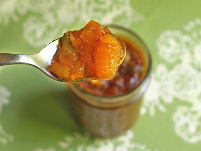

# Mango chutney

*This lightly spiced, sweet chutney provides a lovely contrast to a spicy meal and is perhaps one of the best known and loved Indian chutneys.*

**Serves:** 8 (makes 500 ml preserve)

**Prep Time:** 20 minutes

**Cook Time:** 60 minutes

## Overview
A delicate, fruity preserve balanced with warm spice notes and bright acidity. This mango chutney captures the sweetness of ripe fruit while nigella seeds and warm spices provide intricate flavour layers perfect alongside curries, game, and cheese selections.

## Ingredients

### Aromatics & spices
- 1 tablespoon sunflower oil
- 1 teaspoon ginger (finely grated)
- 1 garlic cloves (crushed)
- 5 cloves
- 1 star anise
- 2 cinnamon sticks
- 5 black peppercorns
- 2 tablespoons nigella seeds
- ½ teaspoon mild chilli powder

### Fruit & binding
- 800 grams ripe but firm mango flesh (chopped)
- 400 ml white wine vinegar
- 270 grams caster sugar
- sea salt

## Method

### Stage 1 – Toast spices
1. Heat the sunflower oil in a saucepan over a medium heat.
1. Add the ginger, garlic, cloves, star anise, cinnamon, peppercorns, nigella seeds and chilli powder and stir-fry for 1–2 minutes.

### Stage 2 – Cook chutney
1. Add the mango, vinegar and sugar and bring to the boil.
1. Reduce the heat to low and cook for 45 minutes, or until the mixture is jam-like.

### Stage 3 – Jar and store
1. Season with sea salt to taste and pour into hot sterilized jam jars.
1. Seal and leave to cool before storing in the refrigerator for up to 2 months.

## Notes
- **Mango selection:** Use fruit that is ripe but still firm; overripe mangoes will become too soft and lose structure.
- **Nigella seeds:** These tiny, onion-scented seeds are essential to authentic mango chutney; they add subtle complexity.
- **Spices:** Toast the whole spices briefly to release their oils; this amplifies flavour significantly.

## Serving
Serve alongside curries, with roasted game and charcuterie, or as part of a cheese board. Also excellent with pâté and cold roasted meats.

## Storage
- Keeps refrigerated for up to 2 months in sealed glass jars.
- Does not freeze well due to sugar content and texture changes.
- Best eaten after 2–3 days once flavours have developed; improves over time.