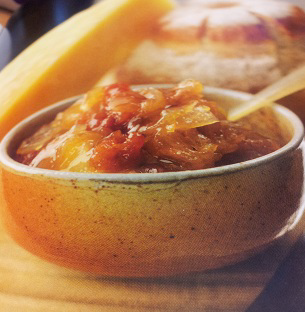

# Onion and green apple chutney

*This chutney is superb with mature cheese, sausage and roast pork - hot or cold. This also works with left over partridge or pheasant.*

**Serves:** 10 (makes 800 grams preserve)

**Prep Time:** 20 minutes

**Cook Time:** 60 minutes

## Overview
A caramelized onion preserve with tart apple and bright tomato notes. This complex chutney balances deep sweetness with vinegary sharpness and spiced warmth, making it an ideal accompaniment to mature cheeses, sausages, and roasted meats.

## Ingredients

### Base
- 50 ml  groundnut oil
- 400 grams onions (thinly sliced)
- 120 grams soft brown sugar
- 150 ml white wine vinegar

### Fruit & vegetables
- 150 grams apple (Granny Smith, Peeled, cored and large dice)
- 150 grams very ripe tomatoes (peeled, de-seeded and small dice)

### Spices & seasoning
- 10 white peppercorns (crushed)
- half a teaspoon fine sea salt
- 1 clove garlic (crushed into a purée)
- half a teaspoon chilli powder
- pinch ground cinnamon

## Method

### Stage 1 – Caramelize onions
1. Heat the groundnut oil in a heavy-based saucepan, add the onions and sweat gently over a low heat for 10 minutes. 
1. Add the sugar, increase the heat slightly and cook until the onions are golden and lightly caramelised, stirring every minute or so with a wooden spoon.

### Stage 2 – Add remaining ingredients
1. Pour in the wine vinegar to deglaze and cook for 3 minutes, then add the remaining ingredients. 

### Stage 3 – Cook down
1. Cook, stirring frequently, over a gently heat for 45 minutes until thick. 
1. The chutney is thick enough when a wooden spoon drawn across the bottom of the pan leaves a clear channel for a few seconds.

### Stage 4 – Jar
1. Pour the chutney into a warm, sterilised preserving jar and seal with a vinegar proof lid. 
1. Store in the fridge for up to 1 month.

## Notes
- **Caramelizing:** Take time with this step; deeply golden onions develop complex, sweet flavours that define the chutney.
- **Apple choice:** Granny Smith's tartness is essential; they provide acidity to balance the sweetness and prevent the chutney from becoming cloying.
- **Texture:** The chutney thickens as it cools; it should be spreadable, not runny, once fully set.

## Serving
Serve with mature cheeses, cured meats, roasted pork, and sausages. Also excellent with roasted game and terrines.

## Storage
- Keeps refrigerated for up to 1 month in sealed jars.
- Does not freeze well; texture becomes grainy when thawed.
- Flavours improve after 2–3 days of storage.