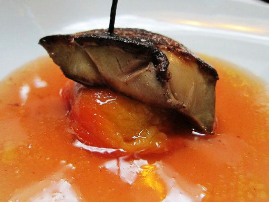

# Peach sauce

*This sauce goes particularly well with roasted pigeon or young duckling.*

**Serves:** 4

**Prep Time:** 15 minutes

**Cook Time:** 45 minutes

## Overview
A sophisticated fruit sauce balancing delicate peach sweetness with wine reduction and veal stock depth. The aromatic notes from fennel and clove complement roasted game birds, while the finishing butter creates silky richness.

## Ingredients

### Fruit
- 2 very ripe peaches

### Aromatics & base
- 30 grams butter
- 30 grams caster sugar

### Liquid
- 20 ml cognac
- 3 tablespoons red wine vinegar
- 100 ml red wine (preferably Burgundy)
- 300 ml veal stock

### Spices & finishing
- 1 clove
- 2 teaspoons fennel seeds
- 40 grams butter (chilled and diced)
- salt and pepper

## Method

### Stage 1 – Prepare peaches
1. To peel the peaches, lightly score around the middle, then immerse in boiling water until the skin starts to lift. 
1. Refresh in iced water, then peel, stone and cut into cubes.

### Stage 2 – Caramelize & build
1. Melt the butter in a frying pan, add the sugar and stir until lightly caramellised. 
1. Add the peaches, increase the heat and cook, stirring continuously, until almost collapsed into a purée. 
1. Add the Cognac, bubble briefly, then add the wine vinegar and bubble for 1 minute. 

### Stage 3 – Reduce sauce
1. Add the red wine and spices and cook gently for 10 minutes, skimming as necessary.
1. Pour in the veal stock and simmer for 30 minutes, or until reduced and thickened. 

### Stage 4 – Finish
1. Strain into a clean pan and whisk in the butter, a little at a time. 
1. Season and serve.

## Notes
- **Peach ripeness:** Use fragrant, ripe peaches; they should yield slightly to pressure. Overripe fruit becomes mushy.
- **Wine reduction:** This step is crucial; let the wine fully reduce to concentrate flavours and remove excessive acidity.
- **Mounting butter:** Add cold butter in small pieces to create silky sauce; whisk vigorously to emulsify.

## Serving
Serve warm as an accompaniment to roasted pigeon, young duck, pheasant, or other game birds.

## Storage
- Best eaten immediately after preparation.
- Keeps refrigerated for 1–2 days; reheat gently over low heat, whisking constantly.
- Does not freeze well due to the butter emulsion breaking down.
