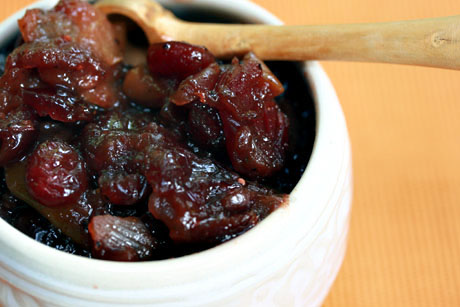

# Pear chutney

*After making, this chutney is best left for a few days before eating, to allow the flavours to develop. Serve it with cold meats, terrines, pâté and game, or spread on bread.*

**Serves:** 8 (makes 600 grams preserve)

**Prep Time:** 30 minutes

**Cook Time:** 105 minutes

## Overview
A complex preserve with sweet pear balanced by warm spice and bright citrus. This sophisticated chutney deepens with time as flavours meld, featuring saffron's delicate floral notes and orange zest brightness alongside traditional warming spices.

## Ingredients

### Base & aromatics
- 60 grams cooking apples (cored, peeled and chopped)
- half a teaspoon salt
- 125 grams very ripe tomatoes (peeled, de-seeded and chopped)
- 60 grams onion (finely chopped)
- 15 grams ginger (finely chopped)

### Fruit & citrus
- 60 grams sultanas
- 1 tablespoon orange zest (coarsely chopped)
- juice of 1 orange
- 375 grams ripe, but firm pears

### Spices & sugar
- 150 grams caster sugar
- 1/4 teaspoon ground cinnamon
- 1/4 teaspoon ground nutmeg
- 1/4 teaspoon cayenne pepper
- pinch saffron threads
- 150 ml white wine vinegar

## Method

### Stage 1 – Cook base mixture
1. Combine all the ingredients, except the pears in a heavy-based saucepan. 
1. Stir and bring to the boil over a very low heat, stirring from time to time with a wooden spoon.
1. Continue to cook for about 1 hour, giving the mixture a stir every 10 minutes, until it is jam like and syrupy. 
1. Test by running your finger down the back of the spoon; it should leave a clear trace.

### Stage 2 – Add & finish pears
1. In the meantime, peel and core the pears, then cut into small even-sized pieces. 
1. Add to the chutney mixture and cook very gently for another 40 minutes, stirring every 10 minutes.

### Stage 3 – Jar
1. Transfer the chutney to a warm, sterilised preserving jar and leave to cool, then seal the jar. 
1. This will keep in the fridge for up to several weeks.

## Notes
- **Saffron:** This expensive spice adds delicate floral complexity; do not omit as it defines the chutney's character.
- **Pear preparation:** Cut evenly sized pieces so they cook uniformly; uneven sizes lead to some portions becoming mushy.
- **Flavour development:** Allow at least 3 days before eating; flavours improve significantly as they meld together.

## Serving
Serve with cold roasted game, terrines, pâté, and charcuterie. Also excellent with mature cheeses and spread on crusty bread.

## Storage
- Keeps refrigerated for up to 3 weeks in sealed jars.
- Does not freeze well; preserve by refrigeration only.
- Improves with age; best eaten 3–7 days after making as flavours develop and mature.