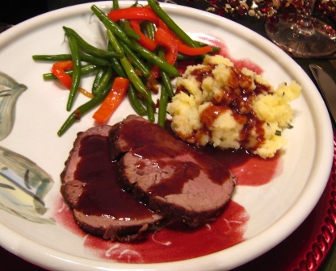

# Port sauce

*This light sauce is excellent with pan-fried pheasant breasts and venison cutlets.*

**Serves:** 4

**Prep Time:** 10 minutes

**Cook Time:** 35 minutes

## Overview
A delicate, wine-based sauce with fruity port and umami-rich mushrooms balanced by tart blackcurrants or cranberries. This elegant sauce complements game birds and venison with sophisticated depth and subtle sweetness.

## Ingredients

### Base
- 60 grams butter
- 60 grams shallots (very finely sliced)

### Vegetables & fruit
- 100 grams button mushrooms (finely sliced)
- 50 grams blackcurrants (or cranberries)

### Liquid & aromatics
- 250 ml ruby port
- dried zest of 1/4 of an orange (see notes)
- 300 ml Veal stock
- salt and pepper

## Method

### Stage 1 – Cook vegetables
1. Melt half the butter in a small saucepan. 
1. Add the shallots and sweat until soft, then add the mushrooms and fruit and cook gently for 3–4 minutes.

### Stage 2 – Build sauce
1. Pour in the port, add the orange zest and reduce by one-third. 
1. Add the stock and simmer for 25 minutes, skimming the surface whenever necessary.

### Stage 3 – Finish
1. Pass the sauce through a fine-meshed conical sieve into a clean pan. 
1. Swirl in the rest of the butter, shaking and rotating the pan, then season to taste with salt and pepper.
1. The sauce is now ready to serve.

## Notes
- **Dried orange zest:** To dry, lay strips on a baking sheet and dry in the oven on its lowest setting for about 2 hours. Leave to cool. This concentrates the flavour and removes excess moisture.
- **Fruit selection:** Blackcurrants provide tartness; cranberries offer slight bitterness; use whichever suits your taste preference.
- **Mounting butter:** The final butter enrichment creates silky body; do not skip this stage.

## Serving
Serve warm alongside pan-fried pheasant breasts, venison cutlets, or other game meats.

## Storage
- Best eaten immediately or within a few hours of making.
- Keeps refrigerated for 1–2 days; reheat very gently without boiling to prevent emulsion breaking.
- Does not freeze well due to butter emulsion separating upon thawing.