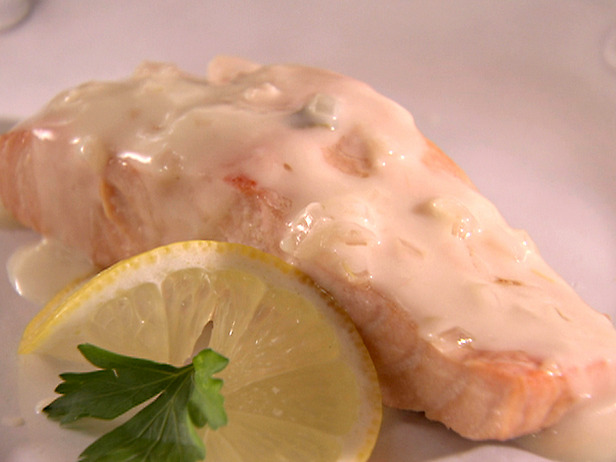

# Champagne sauce

*This sauce is perfect for poached fish, such as John Dory, turbot or sole. You can substitute sparkling white wine for the Champagne, but the sauce will not taste quite as good.*

**Serves:** 6

**Prep Time:** 10 minutes

**Cook Time:** 30 minutes

## Overview
An elegant, cream-enriched sauce with effervescent wine and delicate mushroom undertones. The subtle bubbles and pale golden colour make this a showstopper accompaniment for refined poached fish presentation.

## Ingredients

### Base
- 50 grams butter

### Aromatics
- 60 grams shallots (very finely sliced)
- 60 grams button mushroom (finely sliced)

### Liquid & finishing
- 400 ml champagne
- 300 ml Fish stock
- 350 ml double cream
- salt and pepper

## Method

### Stage 1 – Sweat vegetables
1. Melt 20 grams of butter in a saucepan. Add the sliced shallots and sweat them for 1 minute, without colouring. 
1. Add the mushrooms and cook for a further 2 minutes, stirring continuously with a wooden spatula.

### Stage 2 – Reduce champagne
1. Pour in the Champagne and reduce by one-third over a medium heat. 

### Stage 3 – Build sauce
1. Add the fish stock and reduce the sauce by half.
1. Pour in the cream and let the sauce bubble to reduce until it lightly coats the back of a spoon. 

### Stage 4 – Finish
1. Pass it through a fine-meshed conical sieve into a clean pan.
1. Whisk in the remaining butter, a piece at a time, then season the sauce to taste with salt and pepper.

## Notes
- **Champagne quality:** Use non-vintage Champagne; avoid very expensive vintages as the flavour will be masked by reduction.
- **Sparkling wine substitution:** Cava or Prosecco work acceptably but lack Champagne's complexity and finesse.
- **Blending option:** For lighter texture, purée the sauce in a blender for 1 minute before serving.

## Serving
Serve immediately with poached John Dory, turbot, sole, or other delicate white fish. Ideal for special occasions and elegant presentations.

## Storage
- Best eaten immediately after preparation.
- Keeps refrigerated for 1 day; reheat very gently, stirring constantly to maintain emulsion.
- Does not freeze well due to cream content and champagne volatility.