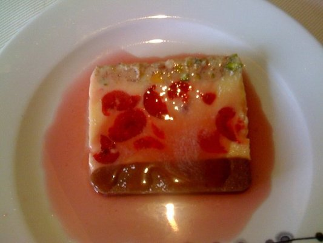

# Claret sauce

*This characterful sauce makes a wonderful base for pink-fleshed fish, such as salmon, red mullet or tuna escalope. Pan-fry the fish at the last moment, pour the sauce on to the plate and place the fish on top.*

**Serves:** 8

**Prep Time:** 10 minutes

**Cook Time:** 35 minutes

## Overview
A deeply coloured, wine-rich sauce combining red wine, dual stocks, and mushroom earthiness. This sophisticated accompaniment to pink-fleshed fish features velvety texture from butter enrichment and subtle depth from long reduction.

## Ingredients

### Liquid
- 300 ml full bodied red wine
- 200 ml Veal stock
- 300 ml Fish stock

### Aromatics & vegetables
- 50 grams shallots (finely sliced)
- 60 grams button mushrooms (finely sliced)
- 1 Bouquet garni

### Finishing
- 50 ml double cream
- 200 grams butter
- salt and pepper

## Method

### Stage 1 – Combine & reduce
1. Pour the red wine and both stocks into a saucepan and add the sliced shallots, mushrooms and bouquet garni.
1. Bring to the boil over a medium heat and let bubble to reduce until slightly syrupy.

### Stage 2 – Add cream
1. Remove the bouquet garni, add the cream and let the sauce bubble for a minute or so, then strain it through a fine-meshed conical sieve into a clean saucepan.

### Stage 3 – Finish with butter
1. Whisk in the butter, a piece at a time, until the sauce is rich and glossy. 
1. Season to taste and serve hot.

## Notes
- **Wine selection:** Choose a full-bodied red (Burgundy or Bordeaux style) with good colour; light wines will fade during reduction.
- **Reduction:** The sauce should be noticeably syrupy and glossy before adding cream; this concentrates flavours.
- **Butter mounting:** Do not boil after butter is added; maintain low heat to keep emulsion smooth.

## Serving
Serve immediately with pan-fried salmon, red mullet, tuna, or other pink-fleshed fish. Plate fish atop sauce for elegant presentation.

## Storage
- Best eaten immediately after preparation.
- Keeps refrigerated for 1 day; reheat gently, whisking constantly to prevent emulsion breaking.
- Does not freeze well due to butter-based emulsion and cream content.