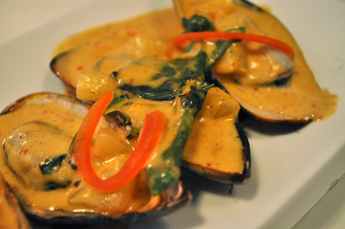

# Curried mussel sauce

*Perfect with shelled mussels cooked à la marinière, this is also very good with poached cod or halibut, nice pilaf and pasta.*

**Serves:** 6

**Prep Time:** 10 minutes

**Cook Time:** 30 minutes

## Overview
A creamy, warmly spiced sauce featuring mussel cooking juices and curry powder. This elegant accompaniment works beautifully with shellfish and white fish, the cream balancing the curry spice while mussel brine adds briny depth.

## Ingredients

### Base
- 50 grams butter
- 60 grams onions, finely chopped

### Spice & flour
- 2 teaspoons curry powder
- 15 grams plain flour

### Liquid & finishing
- 500 ml cooking liquor from mussels and other shellfish (cooled)
- 1 Bouquet garni
- 150 ml double cream
- salt and pepper

## Method

### Stage 1 – Make roux
1. Melt the butter in a saucepan, add the onions and sweat over a low heat for 3 minutes. 
1. Add the curry powder, then the flour, stir with a wooden spoon and cook for another 3 minutes.

### Stage 2 – Build sauce
1. Pour in the cold shellfish juices, add the bouquet garni and bring to the boil.
1. Let the sauce bubble very gently for 20 minutes, stirring every 5 minutes.

### Stage 3 – Finish
1. Add the cream, let bubble for another minute or so, then discard the bouquet garni.
1. Season the sauce to taste with salt and pepper. Serve immediately.

## Notes
- **Roux importance:** Don't skip the flour-cooking step; this removes raw flour taste and creates smooth sauce base.
- **Cold shellfish liquid:** Always use cooled liquid to prevent lumps forming in the sauce.
- **Curry powder quality:** Use fresh curry powder; old spices lose potency and flavour will be flat.

## Serving
Serve immediately with shelled mussels cooked à la mari nière, poached cod, halibut, or other white fish. Accompany with pilaf rice or pasta.

## Storage
- Keeps refrigerated for 2–3 days in an airtight container.
- Freezes well for up to 1 month.
- Best eaten fresh; reheat gently, stirring frequently to prevent lumping.