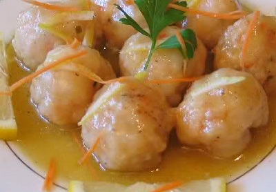

# Lemon sauce

*This wonderfully fragrant lemon sauce is perfect for white firm-fleshed steamed fish, it is also suited to stir-fried chicken.*

**Serves:** 4

**Prep Time:** 10 minutes

**Cook Time:** 5 minutes

## Overview
A bright, Asian-inspired sauce balancing fresh lemon with umami-rich soy and aromatic ginger. This fragrant, glossy accompaniment brings clean acidity and subtle heat to steamed white fish and stir-fried chicken.

## Ingredients

### Base liquid
- 70 ml [Chinese chicken stock](../../stocks/chinese-chicken-stock.md)

### Flavourings
- 1½ tablespoons lemon juice (freshly squeezed)
- 2 teaspoons sugar
- 2 teaspoons light soy sauce
- 2 teaspoons dry sherry or rice wine
- ½ teaspoon garlic (finely chopped)

### Aromatics & thickener
- 1 dried red chilli
- 1 teaspoon cornflour (blended with 1 teaspoon water)

## Method

### Stage 1 – Build sauce base
1. Add all the sauce ingredients except for the cornflour mixture to a small saucepan.
1. Bring it to the boil over a high heat and then add the cornflour mixture.

### Stage 2 – Thicken & serve
1. Simmer for 1 minute until glossy and thickened.
1. Return the protein (chicken strips or steamed fish) to the sauce and stir-fry them long enough to coat them all well with the sauce.
1. Turn onto a platter and serve at once.

## Notes
- **Cornflour slurry:** Always blend cornflour with cold liquid before adding to hot sauce to prevent lumps forming.
- **Fresh lemon juice:** Essential for bright flavour; bottled juice lacks the same aromatic qualities.
- **Chilli heat:** Leave the dried chilli whole for mild background warmth; break it up for more intense spice.

## Serving
Serve immediately with steamed white fish fillets, poached fish, or stir-fried chicken. Also excellent with prawn dishes.

## Storage
- Best eaten immediately after preparation.
- Keeps refrigerated for 1 day; reheat gently, stirring to reincorporate any separated ingredients.
- Does not freeze well; cornflour-thickened sauces become grainy upon thawing.