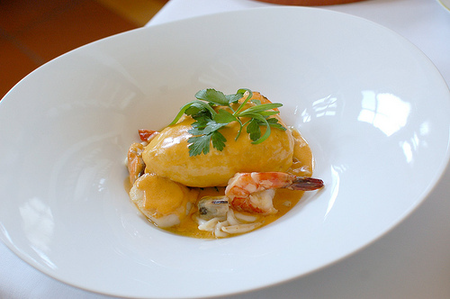

# Nantua sauce

*An excellent sauce for scallops, langoustine and any white fish with delicate, firm flesh.*

**Serves:** 8

**Prep Time:** 15 minutes

**Cook Time:** 50 minutes

## Overview
A sumptuous, pale pink sauce built on a foundation of crayfish shells and aromatics. Cream and subtle tarragon notes create elegance, while the velvety puree captures delicate shellfish essence perfect for refined seafood presentations.

## Ingredients

### Base
- 80 grams butter

### Aromatics & shellfish
- 60 grams shallots (very finely sliced)
- 60 grams button mushrooms (very finely sliced)
- 16 crayfish or langoustine heads (roughly chopped)

### Liquid
- 2 tablespoons cognac
- 150 ml dry white wine
- 300 ml Fish stock

### Vegetables & finishing
- 1 Bouquet garni
- 2 sprigs tarragon
- 80 grams tomatoes (very ripe, peeled and de-seeded)
- 1 pinch cayenne pepper
- 300 ml double cream
- 1 pinch tarragon (very finely chopped to serve)
- salt and pepper

## Method

### Stage 1 – Sweat aromatics
1. Melt 40 gram butter in a shallow saucepan over a low heat. Add the sliced shallots and mushrooms and sweat for 1 minute.

### Stage 2 – Cook shellfish
1. Add the crayfish or langoustine heads to the pan, increase the heat and fry briskly for 2–3 minutes, stirring continuously with a spatula.
1. Pour in the cognac and ignite with a match. Once the flames have died down, add the white wine and reduce by half, then pour in the fish stock. 

### Stage 3 – Build sauce
1. Bring to the boil, then lower the heat so that the sauce bubbles gently.
1. Add the bouquet garni, tomatoes, cayenne and a sprinkle of salt and cook for 30 minutes.
1. Stir in the cream and let sauce bubble for another 10 minutes. 
1. Discard the bouquet garni. 

### Stage 4 – Puree & finish
1. Transfer the contents of the pan to a blender and purée for 2 minutes.
1. Strain the sauce through a fine-meshed conical sieve into a clean saucepan, rubbing it through with the back of a ladle. 
1. Bring the sauce back to the boil and season with salt and pepper to taste.
1. Off the heat, whisk in the remaining butter, a little at a time, until the sauce is smooth and glossy.
1. It is now ready to serve. A little finely chopped tarragon added at the last moment will enhance the flavour.

## Notes
- **Shellfish heads:** These create the sauce's delicate flavour; use crayfish or langoustine for best results.
- **Cognac flaming:** This caramelizes the shells; let flames die naturally without snuffing.
- **Pureeing:** This step is essential for smooth, silky texture; blend thoroughly to break down all shell fragments.

## Serving
Serve immediately with scallops, langoustine, or delicate white fish fillets including sole, turbot, or halibut.

## Storage
- Best eaten immediately after preparation.
- Keeps refrigerated for 1–2 days; reheat very gently without boiling to prevent emulsion separating.
- Does not freeze well due to butter-based emulsion and shellfish content.