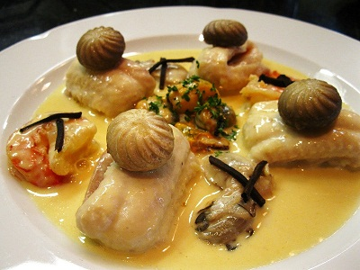

# Normandy sauce

*The classic sauce for sole à la Normande, this goes well with most white fish. The addition of mussel cooking juices makes it extra special.*

**Serves:** 6

**Prep Time:** 10 minutes

**Cook Time:** 35 minutes

## Overview
An elegant, silky white sauce enriched with eggs and cream, featuring tender mushrooms and subtle mussel brine. This classic French preparation combines velouté base with delicate seafood essence, creating refined sophistication.

## Ingredients

### Base
- 60 grams butter
- 30 grams plain flour

### Vegetables & aromatics
- 100 grams button mushrooms (thinly sliced)
- 1 sprig thyme

### Liquid
- 500 ml Fish stock
- 50 ml mussel juice (optional)

### Finishing
- 200 ml double cream
- 3 egg yolks
- juice of 1/2 a lemon
- salt and pepper

## Method

### Stage 1 – Make roux
1. Melt 30 grams of butter in a heavy-bases saucepan, then take off the heat and stir in the flour. 
1. Return to a medium-low heat and cook for 2–3 minutes, stirring constantly, to make a white roux.

### Stage 2 – Sweat mushrooms
1. Meanwhile, melt the remaining 30 grams of butter in another saucepan over a low heat. 
1. Add the mushrooms and thyme and sweat them for 2 minutes, then stir in the hot roux.

### Stage 3 – Build sauce  
1. Gradually pour in the fish stock and mussel juice, if using, mixing with a small whisk.
1. Bring to the boil, still whisking, and let the sauce bubble gently for 20 minutes, stirring it with the whisk every 5 minutes.

### Stage 4 – Finish with egg yolks
1. Meanwhile, mix the cream with the egg yolks. Stir the mixture into the sauce with the lemon juice and let it continue to bubble gently for another 10 minutes.
1. Season to taste with salt and white pepper. Pass the sauce through a fine-meshed conical sieve and serve immediately.

## Notes
- **White roux:** Cook adequately to remove raw flour taste but don't let it colour; control heat carefully.
- **Egg liaison:** Mix cream and yolks well before adding; add slowly while stirring to prevent scrambling.
- **Mussel juice:** If available from mussels cooked à la mari nière, add for authentic Norman flavour; optional but recommended.

## Serving
Serve immediately with sole, other white fish fillets, or shellfish. Classic pairing for sole à la Normande.

## Storage
- Best eaten immediately after preparation.
- Keeps refrigerated for 1 day; reheat gently, stirring constantly to maintain emulsion without boiling.
- Does not freeze well due to egg yolk content and emulsion instability.