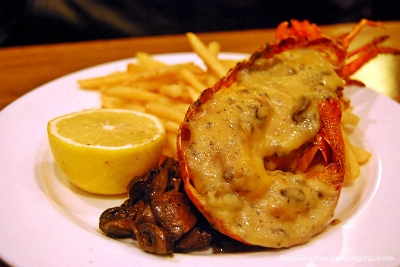

# Thermidor sauce

*This famous companion to lobster thermidor works with most crustaceans. It tastes wonderful mixed with crab meat and served au gratin.*

**Serves:** 6

**Prep Time:** 10 minutes

**Cook Time:** 30 minutes

## Overview
A sophisticated, tangy cream sauce with mustard warmth and tarragon herbals. This classic accompaniment to lobster thermidor combines cheese sauce with white wine reduction and a distinctive mustard flavour profile.

## Ingredients

### Wine reduction base
- 40 grams shallots (very finely chopped)
- 200 ml Fish stock
- 200 ml dry white wine

### Sauce base
- 300 ml Béchamel Sauce

### Finishing
- 100 ml double cream
- 1 teaspoon Dijon mustard
- 1 teaspoon English mustard powder
- 50 grams butter (well chilled and diced)
- 1 pinch cayenne pepper
- 1 tablespoon tarragon (finely chopped)
- salt

## Method

### Stage 1 – Reduce wine
1. Combine the shallot, fish stock and white wine in a saucepan and let bubble until the liquid has reduced by two-thirds. 

### Stage 2 – Build sauce
1. Add the béchamel and cook the sauce over a low heat for 20 minutes, stirring every 5 minutes.
1. Pour in the cream, let bubble for 5 minutes, then add both mustards and cook for another 2 minutes.

### Stage 3 – Finish
1. Turn off the heat and whisk the butter into the sauce, a piece at a time. Season with salt and a good pinch of cayenne to taste. 
1. Finally add the tarragon, if using, and serve immediately.

## Notes
- **Wine reduction:** Reduce by two-thirds to concentrate flavours; this is essential to the sauce's character.
- **Mustards:** Use both Dijon and English mustard powder for complexity; each adds different heat and flavour.
- **Cognac optional:** Add a teaspoonful of Cognac at the end of cooking for extra richness, if desired.

## Serving
Serve immediately with lobster thermidor, crab thermidor, and other crustaceans. Also excellent mixed with crab meat and served au gratin.

## Storage
- Best eaten immediately after preparation.
- Keeps refrigerated for 1–2 days; reheat gently without boiling to prevent emulsion breaking.
- Does not freeze well due to butter emulsion and béchamel base.