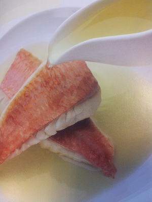

# Tomato and basil fish fumet

*Steamed fillets of fish with delicate flesh, like red mullet, John Dory or sea bream are delicious served in a deep plate, bathed with a ladle of this fumet.*

**Serves:** 4

**Prep Time:** 10 minutes

**Cook Time:** 25 minutes

## Overview
A crystal-clear, jewel-coloured consommé featuring ripe tomato and fragrant basil. This elegant, clarified fish broth brings clean, bright flavours and sophisticated simplicity to delicate white fish.

## Ingredients

### Base
- 600 ml Fish stock

### Clarification
- 500 grams very ripe tomatoes (chopped)
- 1 red pepper (cored, de-seeded and finely chopped)
- 50 grams basil leaves (coarsely chopped)
- 4 egg whites
- 8 peppercorns (crushed)
- salt and pepper

## Method

### Stage 1 – Prepare clarification mixture
1. Mix the clarification ingredients together thoroughly in a bowl.

### Stage 2 – Clarify fumet
1. Pour the fish stock into a saucepan and add the clarification mixture. 
1. Bring to the boil over a medium heat, stirring with a wooden spoon. 
1. As soon as the liquid boils, reduce the heat and simmer very gently for 20 minutes.

### Stage 3 – Strain & serve
1. Pass the clarified fumet through a fine meshed conical sieve, season with salt and pepper to taste and serve.

## Notes
- **Clarification:** This technique removes impurities, creating crystal-clear consommé with pure flavour; don't skip steps.
- **Gentle simmering:** Boiling vigorously will cloud the fumet; maintain a bare simmer throughout.
- **Egg white raft:** The white and vegetable mixture forms a natural filter; ladle gently to avoid disturbing.

## Serving
Serve in heated shallow bowls with delicate-fleshed white fish fillets (red mullet, John Dory, sea bream) poached or steamed in the fumet itself.

## Storage
- Keeps refrigerated for 2–3 days in an airtight container.
- Freezes well for up to 1 month.
- Best served hot, immediately after straining.