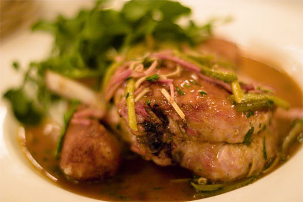

# Charcutière sauce

*This homely piquant sauce is delicious with pork chops.*

**Serves:** 4

**Prep Time:** 10 minutes

**Cook Time:** 20 minutes

## Overview
A rustic, mustard-forward sauce with sharp cornichon notes and white wine acidity. This traditional French accompaniment brings homemade charm and tongue-tingling heat to pork chops and other pork preparations.

## Ingredients

### Base
- 30 grams butter

### Aromatics & liquid
- 60 grams onions (finely chopped)
- 100 ml dry white wine
- 300 ml Veal stock

### Flavour & texture
- 1 tablespoon strong Dijon mustard
- 40 grams beurre manié (see notes)
- 30 grams cornichons (cut into long thin strips)
- salt and pepper

## Method

### Stage 1 – Sweat onions
1. Melt the butter in a small saucepan, add the onions and sweat gently without colouring for 1 minute. 

### Stage 2 – Reduce wine
1. Pour in the white wine and let bubble over a medium heat to reduce by half.

### Stage 3 – Build sauce
1. Add the veal stock and bubble the sauce gently until it is thick enough to lightly coat the back of a spoon. 
1. Whisk in the mustard and the beurre manié, a little at a time, and cook for another 2 minutes. 
1. Season with salt and pepper to taste.

### Stage 4 – Add cornichons & finish
1. Pass the sauce through a fine-meshed conical sieve into a small pan containing the cornichons. 
1. Serve it immediately, or keep warm for a few minutes in a bain-marie set over a low heat.

## Notes
- **Beurre manié:** A mixture of equal parts soft butter and flour, mixed together with a fork. This thickens the sauce rapidly and creates silky body. Incorporate small pieces at a time, whisking constantly.
- **Mustard quality:** Use strong Dijon mustard; weak mustard will result in bland sauce.
- **Cornichons:** Their sharp acidity is essential to the sauce's character; add after straining to maintain their crunch.

## Serving
Serve immediately with grilled or pan-fried pork chops, roasted pork, or other pork preparations. The mustard acidity and cornichon sharpness complement fatty pork beautifully.

## Storage
- Best eaten immediately after preparation.
- Keeps refrigerated for 1 day; reheat gently without boiling to prevent separation.
- Does not freeze well; beurre manié becomes grainy upon thawing.
