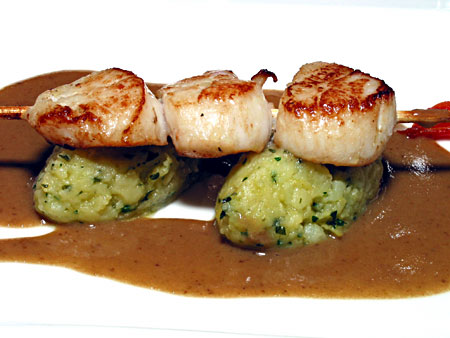

# Chasseur sauce

*This light mushroom and white wine sauce is quick to make, and goes well with poultry and veal.*

**Serves:** 8

**Prep Time:** 10 minutes

**Cook Time:** 20 minutes

## Overview
A delicate, herbaceous sauce featuring tender mushrooms and fresh tarragon notes. The white wine reduction and parsley garnish create bright, clean flavours perfect for poultry and veal, ready in under 30 minutes.

## Ingredients

### Base
- 50 grams butter (at room temperature)
- 50 grams butter (chilled and diced)

### Vegetables
- 200 grams button mushrooms (wiped and finely sliced)
- 40 grams shallots (finely chopped)

### Liquid & herbs
- 400 ml dry white wine
- 400 ml Veal stock
- 1 tablespoon flat leaf parsley (snipped)
- 1 teaspoon tarragon (snipped)
- salt and pepper

## Method

### Stage 1 – Cook mushrooms
1. Melt the non-chilled butter in a shallow pan, add the mushrooms and cook over a medium heat for 1 minute. 
1. Add the shallot and cook for another minute, taking care not to let it colour.
1. Tip the mushroom and shallot mixture into a fine-meshed conical sieve to drain off the cooking butter, then return to the shallow pan. 

### Stage 2 – Reduce wine
1. Add the white wine and let bubble over a medium heat until reduced by a half.

### Stage 3 – Build sauce
1. Pour in the veal stock and cook gently for 10–15 minutes until the sauce has reduced and thickened enough to lightly coat the back of a spoon.

### Stage 4 – Finish with herbs
1. Take the pan off the heat and whisk in the remaining butter, a piece at a time, along with the snipped herbs. 
1. Season to taste with salt and pepper. 
1. The sauce is now ready to serve.

## Notes
- **Mushroom drainage:** Draining off the initial cooking butter prevents the sauce from becoming greasy.
- **Fresh herbs:** Use fresh tarragon and parsley; dried herbs lack the delicate flavour needed for this classic sauce.
- **Quick cooking:** This sauce is fast to prepare; total time is under 30 minutes, making it ideal for quick meals.

## Serving
Serve immediately with sautéed or grilled poultry (chicken, guinea fowl), veal, or other light meats.

## Storage
- Best eaten immediately after preparation.
- Keeps refrigerated for 1 day; reheat gently, stirring constantly.
- Does not freeze well due to butter emulsion and fresh herb content.