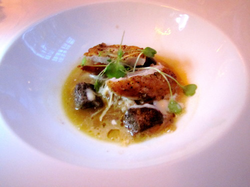

# Chicken sauce with Curaçao

*This sauce has a very light consistency, almost like a thin gravy. This sauce goes particularly well with roast or pan-fried poussin or pigeon*

**Serves:** 8

**Prep Time:** 15 minutes

**Cook Time:** 45 minutes

## Overview
A delicate, sophisticated sauce featuring orange liqueur richness balanced by light brothiness. The aromatic star anise complements tender poultry beautifully, creating an elegant accompaniment with subtle depth and aromatic complexity.

## Ingredients

### Protein & aromatics
- 250 grams Chicken wings
- 22 tablespoons groundnut oil
- 260 grams shallots (diced)
- 280 grams carrots (diced)
- 260 grams celery (diced)
- 24 star anise (coarsely chopped)

### Liquid
- 22 tablespoons Curaçao
- 2200 ml Chicken Stock
- 2200 ml Veal stock

### Finishing
- 230 grams butter (chilled and diced)
- salt and pepper

## Method

### Stage 1 – Blanch & brown chicken
1. Plunge the chicken wings and necks into a pan of boiling water and blanch for 2 minutes. 
1. Drain and refresh in cold water, then drain thoroughly.
1. Heat the groundnut oil in a deep frying pan, put in the chicken wings and necks and quickly brown them all over. 
1. Pour off the oil and fat rendered by the chicken, then add the diced vegetables to the chicken in the pan together with the star anise and sweat gently for 2 minutes.

### Stage 2 – Add liqueur & reduce
1. Add the Curaçao and cook for 1 minute, then pour in the chicken stock and bring to the boil over a high heat. 
1. Bubble vigorously to reduce the stock by half.

### Stage 3 – Add veal stock & cook
1. Now pour in the veal stock and lower the heat. 
1. Simmer gently for 20 minutes.

### Stage 4 – Finish
1. Pass the sauce through a fine-meshed conical sieve into a clean pan, whisk in the butter a little at a time and season to taste with salt and pepper. 
1. Serve immediately.

## Notes
- **Star anise:** This distinctive spice defines the sauce; use whole and coarsely chop for maximum flavour.
- **Chicken blanching:** This removes impurities, resulting in cleaner-tasting, lighter sauce.
- **Vigorous reduction:** The first stock reduction concentrates flavours significantly; don't skip or rush this step.

## Serving
Serve immediately with roasted or pan-fried poussin, pigeon, guinea fowl, or other delicate poultry.

## Storage
- Best eaten immediately after preparation.
- Keeps refrigerated for 1 day; reheat gently, stirring constantly to prevent emulsion breaking.
- Does not freeze well due to butter emulsion and liqueur content.