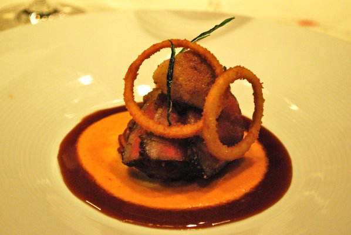

# Lamb jus with rosemary

*A light, easy to prepare jus that goes beautifully with roast lamb*

**Serves:** 8

**Prep Time:** 5 minutes

**Cook Time:** 40 minutes

## Overview
A light, herb-infused jus capturing roasted lamb's natural juices enhanced by rosemary and wine reduction. The caramelized garlic adds subtle sweetness while maintaining the sauce's elegant simplicity.

## Ingredients

### Vegetables & aromatics
- 200 grams carrots (cut into rounds)
- 250 grams onion (cut into large dice)
- 3 cloves garlic (peeled)
- 6 black peppercorns (crushed)
- 2 bay leaves
- 2 rosemary sprigs

### Liquid
- 200 ml red wine (Preferably Grenache)
- salt and pepper

## Method

### Stage 1 – Roast lamb
1. Preheat the oven to 200°C and put the lamb in a roasting tin and roast until lightly browned, about 20 minutes. 
1. Lower the oven setting according to the size and cut of meat and take the roasting tin out of the oven. 
1. Scatter the carrots, onions, garlic cloves, peppercorns and herbs around the lamb and return to the oven.
1. Continue to roast, basting from time to time and stirring the vegetables and herbs around to ensure they colour but do not burn. 

### Stage 2 – Rest meat & deglaze
1. When the lamb is cooked, lift it on to a rack over a platter, partially cover with foil and leave to rest in a warm place.
1. Using a spoon, remove the excess fat from the surface of the juices in the roasting tin. 
1. Now pour in the red wine to deglaze. Cook over a low heat until reduced by two-thirds.

### Stage 3 – Add water & finish
1. Add 3 tablespoons of water (or use chicken stock) and cook for a further 5 minutes, stirring from time to time with a wooden spoon and crushing the garlic cloves with a fork. 
1. The soft garlic flesh will flavour the jus and thicken it slightly.

### Stage 4 – Strain & season
1. Strain the jus through a fine-meshed conical sieve into a saucepan, lightly pressing the vegetables and herbs with the back of a small ladle to extract as much flavour as possible. 
1. Add any juices from the rested red meat and taste for seasoning, adding salt and pepper if necessary. 
1. Keep the jus warm until ready to serve the lamb.

## Notes
- **Wine reduction:** Two-thirds reduction concentrates flavours; don't skip this step for thin, flavorless jus.
- **Garlic crushing:** The soft roasted garlic creates natural body and sweetness; crush thoroughly.
- **Herb selection:** Rosemary's pine notes complement lamb beautifully; bay leaves add sophistication.

## Serving
Serve warm in a jug alongside rested roasted lamb. Perfect for medium-rare to medium lamb.

## Storage
- Keeps refrigerated for 2–3 days in an airtight container.
- Freezes well for up to 2 months.
- Best served warm; reheat gently over low heat.