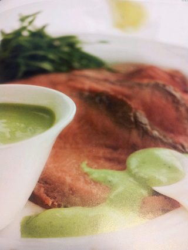

# Rocket sauce with horseradish

*This fresh tasting, healthy sauce goes beautifully with cold meat, or with cold poached salmon or smoked trout.*

**Serves:** 8

**Prep Time:** 10 minutes

**Cook Time:** 0 minutes

## Overview
A vibrant, herb-forward cold sauce combining peppery rocket with sharp horseradish notes. The yoghurt base provides creaminess while lemon brightens the palate, creating an elegant, light accompaniment to cold meats and fish.

## Ingredients

### Base
- 60 grams rocket leaves (stalks removed)
- 150 grams Greek yoghurt

### Flavourings
- 1 tablespoon Dijon mustard
- 3 teaspoons fresh horseradish (finely grated)
- 2 tablespoons extra virgin olive oil
- 2 tablespoons milk
- juice of 1 lemon
- 1 clove garlic (finely chopped)
- salt and pepper

## Method

### Stage 1 – Blend rocket mixture
1. Put all the ingredients, except the yoghurt and seasoning into a blender and process for 2–3 minutes until smooth.

### Stage 2 – Add yoghurt
1. Transfer to a large bowl and whisk in the yoghurt until combined. 
1. Season the sauce with salt and pepper to taste.

### Stage 3 – Chill & serve
1. Cover with cling film and refrigerate until ready to use. 
1. This sauce keeps well for 2–3 days in the fridge, needing only a quick whisk before serving.

## Notes
- **Rocket: Use tender rocket leaves; mature leaves become bitter and fibrous.
- **Fresh horseradish:** Use freshly grated if possible; prepared horseradish in jars loses potency.
- **Yoghurt quality:** Greek yoghurt's richness is essential; regular yoghurt results in thinner sauce.

## Serving
Serve chilled alongside cold roasted meats, cold roasted poultry, cold poached salmon, or smoked trout. Also excellent as a condiment with charcuterie.

## Storage
- Keeps refrigerated for 2–3 days in an airtight container, covered.
- Do not freeze; yoghurt texture becomes grainy upon thawing.
- Best eaten fresh; flavour peaks within first 24 hours.