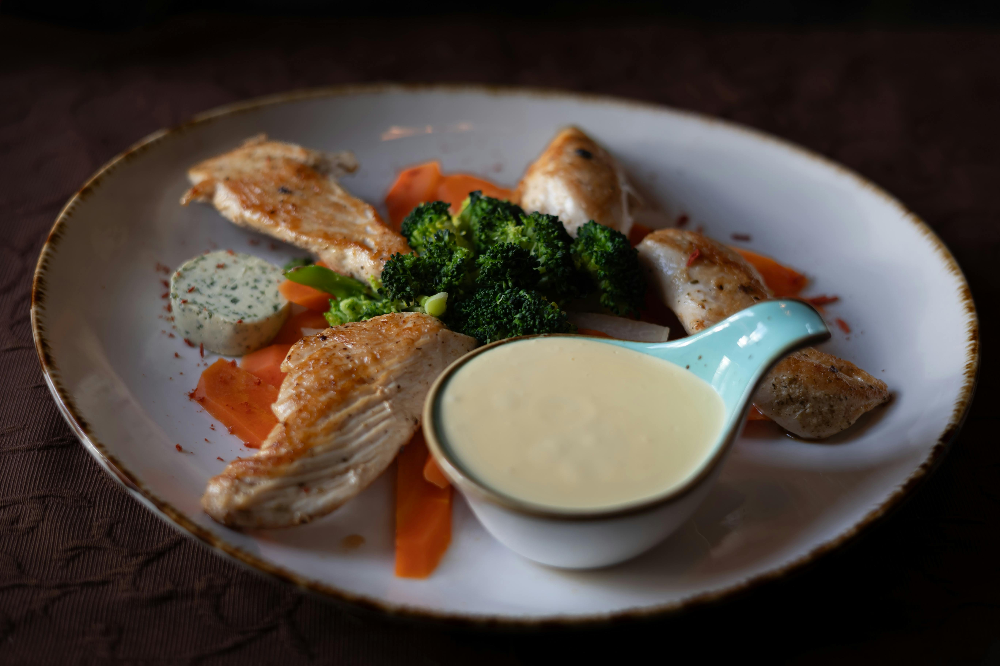

# Béarnaise sauce

*This sauce is equally good with grilled steak and beef fondue.*

**Serves:** 6

**Prep Time:** 10 minutes

**Cook Time:** 15 minutes

## Overview
An elegant, silky emulsion balancing sharp tarragon with creamy, buttery richness. This classic French sauce showcases clarified butter and egg yolks with herbaceous depth, providing the perfect elegant accompaniment to premium beef cuts.

## Ingredients

### Wine reduction
- 2 tablespoons white wine vinegar
- 3 tablespoons tarragon (snipped)
- 30 grams shallots (finely chopped)
- 10 peppercorns (crushed)

### Emulsion
- 4 egg yolks
- 250 grams Clarified butter (cooled to tepid)

### Finishing
- 2 tablespoons parsley
- juice of half a lemon
- salt and pepper

## Method

### Stage 1 – Make reduction
1. Combine the wine vinegar, 2 tablespoons of the tarragon, the shallots and peppercorns in a small, heavy-based saucepan and reduce by half over a low heat.
1. Set aside to cool. When the vinegar reduction is cold, add the egg yolks and 3 tablespoons of cold water. 

### Stage 2 – Create emulsion
1. Set the pan over a low heat, and whisk continuously, making sure that the whisk remains in contact with the bottom of the pan. 
1. As you whisk, gently increase the heat; the sauce should emulsify slowly and gradually, becoming smooth after 8–10 minutes. 
1. Do not let the sauce go above 65° C. Turn off the heat and whisk the clarified butter into the sauce, a little at a time. 

### Stage 3 – Finish
1. Season with salt and pepper to taste and pass through a fine meshed conical sieve into a clean pan. 
1. Stir in the rest of the tarragon, parsley and lemon juice. Check the seasoning, and serve.

## Notes
- **Temperature control:** Critical to prevent curdling; use thermometer and keep sauce below 65°C throughout.
- **Clarified butter:** Must be clarified to prevent white solids from creating grainy texture.
- **Tarragon freshness:** Use fresh tarragon only; dried loses delicate, complex flavour.

## Serving
Serve immediately with grilled or pan-fried steak,beef tournedos, and beef fondue. Also excellent with roasted veal and poultry.

## Storage
- Best eaten immediately after preparation.
- Keeps warm in a bain-marie for up to 30 minutes.
- Does not refrigerate or freeze well; emulsion breaks and texture becomes granular.