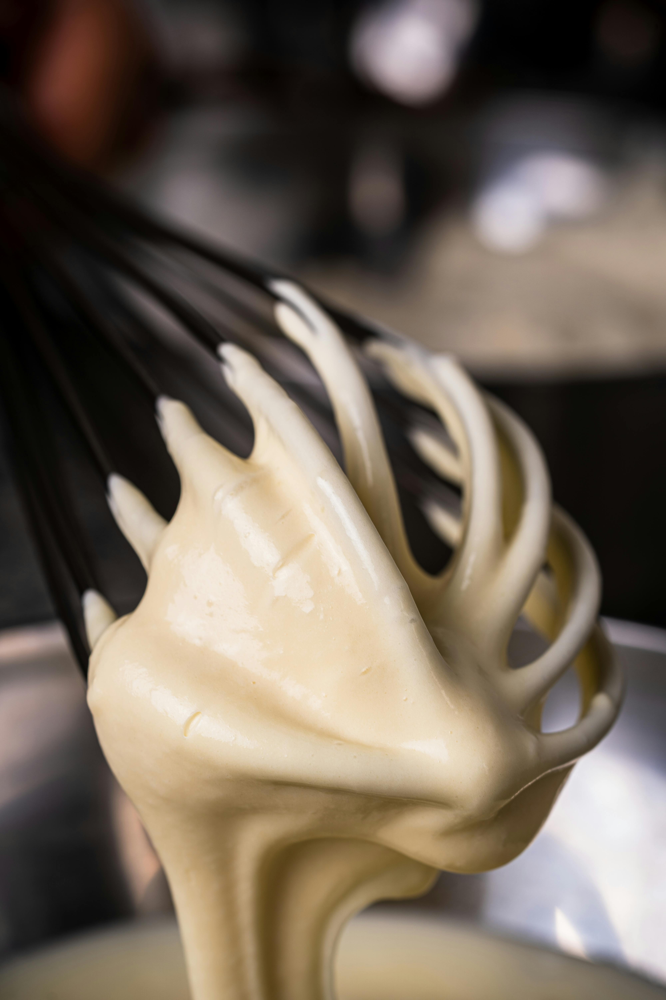

# Beurre blanc with cream

*Simple and delicate, this sauce is delicious with most poached fish.*

**Serves:** 6

**Prep Time:** 5 minutes

**Cook Time:** 10 minutes

## Overview
A silky, butter-enriched reduction combining wine, vinegar, and shallot reduction with cream. This classic French sauce brings elegant richness to poached and steamed fish with bright acidity balanced by luxurious butter body.

## Ingredients

### Wine reduction
- 75 ml dry white wine
- 75 ml white wine vinegar
- 60 grams shallots (finely chopped)

### Finishing
- 50 ml double cream
- 200 grams butter (chilled and diced)
- salt and pepper

## Method

### Stage 1 – Make reduction
1. Combine the white wine, wine vinegar and shallots in a small, heavy-based saucepan and reduce the liquid over a low heat by two-thirds. 
1. Add the cream and reduce again by one-third.

### Stage 2 – Mount butter
1. Over a low heat, whisk in the butter, a little at a time, or beat in using a wooden spoon. 
1. It is vital to keep the sauce barely simmering at 90°C as you incorporate the butter, making sure it does not boil. 
1. Season to taste with salt and pepper and serve immediately.

## Notes
- **Temperature control:** Maintain sauce at exactly 90°C; hotter causes separation, cooler prevents proper emulsion.
- **Butter temperature:** Cold butter pieces emulsify correctly; room temperature butter creates greasy, separated sauce.
- **Never boil:** Once butter is incorporated, do not allow sauce to boil or emulsion will break.

## Serving
Serve immediately with poached fish, steamed fish, delicate white fish fillets, and shellfish. Classic pairing for sole, turbot, and halibut.

## Storage
- Best eaten immediately after preparation.
- Keep warm in bain-marie for up to 20 minutes maximum.
- Does not reheat well; emulsion breaks. Always make fresh when needed.