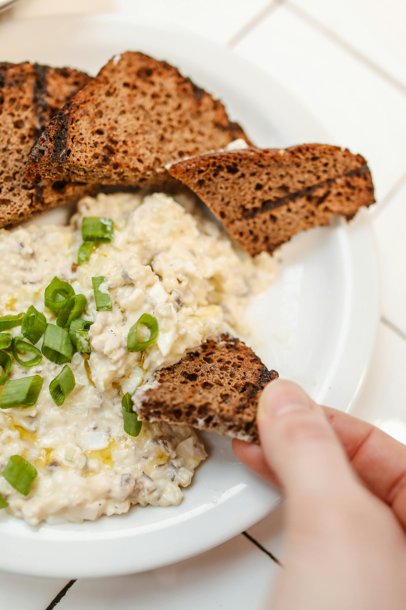

# Bread sauce

*The perfect traditional sauce to accompany a roast dinner.*

**Serves:** 4

**Prep Time:** 5 minutes

**Cook Time:** 55 minutes

## Overview
A traditional, creamy sauce featuring bread softened in milk infused with clove-studded onion. This homely accompaniment to roasted poultry brings subtle spice and gentle texture from breadcrumbs, topped with silky cream finish.

## Ingredients

### Base & aromatics
- 20 grams butter
- 60 grams onion (chopped)
- 400 ml milk
- 1 onion (peeled)
- 2 cloves

### Bread & finishing
- 80 grams white bread (crusts removed and cut into cubes)
- 50 ml double cream
- 1 pinch salt and pepper

## Method

### Stage 1 – Infuse milk
1. Insert the cloves in to the onion. Melt the butter in a small saucepan, and add the chopped onions and sweat gently for 1 minute. 
1. Pour in the milk and add the clove-studded onion and bring to a bare simmer. 
1. Cook gently, stirring occasionally, for 20 minutes.

### Stage 2 – Add bread
1. Stir in the bread cubes and bring to the boil. 
1. Lower the heat and cook the sauce gently for 30 minutes, stirring occasionally with a wooden spoon.

### Stage 3 – Finish
1. Remove the studded onion, add the cream and let the sauce bubble gently for 5 minutes, whisking delicately. 
1. Season with salt and pepper to taste and serve.

## Notes
- **Bread selection:** Use white bread, not wholemeal; white bread dissolves smoothly while wholemeal remains grainy.
- **Cooking time:** Long, gentle cooking allows bread to fully dissolve; rushing results in a lumpy sauce.
- **Onion removal:** The clove-studded onion must be removed before serving to prevent unexpected cloves in diners' mouths.

## Serving
Serve warm alongside roasted chicken, turkey, gamebirds, and other roasted poultry.

## Storage
- Keeps refrigerated for 2 days in an airtight container.
- Freezes well for up to 1 month.
- Best eaten warm; reheat gently over low heat, stirring frequently to prevent sticking.