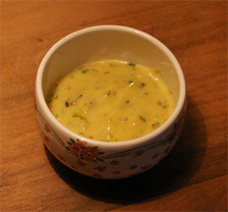

# Gribiche Sauce

*This piquant sauce is especially good served with cold fish, crustaceans, smoked trout and hard boiled eggs.*

**Serves:** 6

**Prep Time:** 15 minutes

**Cook Time:** 0 minutes

## Overview
A vibrant, classically French cold sauce combining hard-boiled egg yolks with tangy vinegar and flavorful aromatics. The pickled vegetables and fresh herbs provide complexity and bright acidity, creating an elegant companion to cold fish and shellfish.

## Ingredients

### Base
- 4 hard boiled eggs
- 1 teaspoon Dijon mustard
- 250 ml groundnut oil
- 1 tablespoon white wine vinegar

### Vegetables & herbs
- 30 grams capers (drained)
- 30 grams cornichons (finely diced)
- 2 tablespoons Fines Herbes (finely snipped)
- salt and pepper

## Method

### Stage 1 – Prepare egg base
1. Separate the hard-boiled egg whites and yolks.
1. Put the yolks, mustard and a little salt and pepper into a mortar and crush with the pestle to make a smooth paste.

### Stage 2 – Create emulsion
1. Gradually trickle in half of the groundnut oil, mixing with the pestle as you go to amalgamate it thoroughly.
1. Still mixing, add the wine vinegar, then continue to trickle in the remaining oil as before.

### Stage 3 – Add vegetables & herbs
1. Coarsely chop the hard boiled egg whites.
1. Add to the sauce with the capers, cornichons and herbs and mix them in with a spoon.

### Stage 4 – Season & serve
1. Season the sauce with salt and pepper to taste.
1. Cover and refrigerate until ready to serve.

## Notes
- **Egg yolk emulsion:** Essential for sauce body; don't skip the mortar work as it creates silky base.
- **Oil temperature:** Cold oil emulsifies best; room temperature oil creates separated, greasy sauce.
- **Fresh herbs:** Fines herbes should be freshly snipped; dried loses delicate flavour needed here.

## Serving
Serve chilled with cold poached fish, smoked trout, shellfish (crab, lobster), and cold eggs. A classic French sauce for charcuterie boards.

## Storage
- Keeps refrigerated for 2 days in an airtight container.
- Does not freeze well; emulsion breaks upon thawing.
- Best eaten fresh; egg yolks oxidize and darken slightly with time.