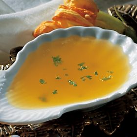

# Lemon butter sauce

*This simple sauce compliments cod and salmon dishes perfectly.*

**Serves:** 4

**Prep Time:** 5 minutes

**Cook Time:** 5 minutes

## Overview
A deceptively simple classical sauce combining butter, bright lemon, and delicate stock into a silky emulsion. Requiring only careful whisking technique, this elegant sauce provides light richness without heaviness, making it the perfect partner for poached or grilled fish.

## Ingredients

### Base
- 225 grams unsalted butter (cut into 1 cm pieces)
- 50 ml stock (Chicken or vegetable)
- juice of 1 lemon

### Seasoning
- salt and freshly ground white pepper

## Method

### Stage 1 – Create base
1. Chop the butter into 1 cm pieces.

### Stage 2 – Emulsify
1. Put the butter pieces into a pan with the lemon juice and stock.
1. Bring to a simmer, whisking all the time.
1. Do NOT allow the sauce to boil or the butter will separate.

### Stage 3 – Adjust texture & season
1. If it is too thick, add more stock.
1. If you prefer a sharper taste, add more lemon juice.
1. Season with salt and white pepper to taste.

### Stage 4 – Finish (optional)
1. To give a creamier texture, purée in a blender.
1. Serve immediately.

## Notes
- **Temperature control:** Keep at a gentle simmer; boiling causes the butter to separate into grease.
- **Whisking:** Constant whisking is essential for creating smooth emulsion between butter and stock.
- **Lemon juice:** Fresh lemon juice is crucial; bottled lemon juice lacks the bright acidity needed.

## Serving
Serve with poached or grilled cod, salmon, sole, or other delicate white fish. Also excellent with steamed vegetables or chicken.

## Storage
- Best served immediately; emulsion breaks with time.
- Can be held in a warm bain-marie at 55°C for up to 15 minutes.
- Does not freeze; emulsion breaks upon thawing.