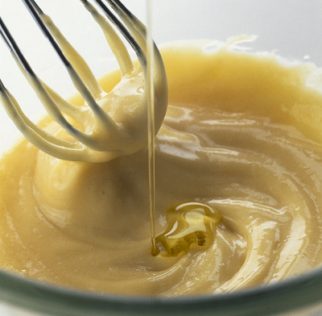

# Mayonnaise

*A fundamental emulsion sauce that serves as the foundation for countless derivatives.*

**Serves:** Makes 300ml

**Prep Time:** 10 minutes

**Cook Time:** 0 minutes

## Overview
The quintessential cold emulsion sauce combining egg yolks, mustard, and oil into a thick, creamy condiment. This kitchen fundamental requires only technique and patience, rewarding careful whisking with luxurious richness that elevates simple ingredients into sophisticated accompaniment for proteins and vegetables.

## Ingredients

### Base & emulsifier
- 2 egg yolks (at room temperature)
- 1 tablespoon Dijon mustard (strong)

### Oil & acid
- 250 ml groundnut oil
- 2 tablespoons white wine vinegar (or lemon juice)

### Seasoning
- salt and pepper

## Method

### Stage 1 – Prepare base
1. Stand a mixing bowl on a tea-towel on the work surface to prevent it slipping.
1. Put the egg yolks, mustard, salt and pepper into the bowl and mix with a balloon whisk.

### Stage 2 – Initial emulsification
1. Slowly add the oil in a thin trickle to begin with, whisking continuously.
1. As the mayonnaise begins to thicken, add the oil in a steady stream, still whisking all the time.

### Stage 3 – Final incorporation
1. When the oil is completely incorporated, whisk more rapidly for 30 seconds until the mayonnaise is thick and glossy.

### Stage 4 – Season
1. Add the vinegar or lemon juice, taste and adjust the seasoning as necessary.

## Notes
- **Broken mayonnaise recovery:** If it separates, leave out at room temperature 30 minutes. Using a high-speed mixer, beat in half teaspoon fresh mustard. Put a spoonful of warm water in clean bowl and beat in a spoonful of broken mayonnaise at high speed. The mixture should foam. Add more broken mayonnaise gradually, beating constantly, until emulsion reforms.
- **Temperature:** All ingredients must be at room temperature for proper emulsification.
- **Oil addition:** Never rush; slow addition of oil is key to smooth emulsion.

## Serving
Serve with salads, cold meats, sandwiches, crudités, or as base for flavored mayonnaises (aioli, rouille, etc.).

## Storage
- Keeps refrigerated in an airtight container for 5-7 days.
- Does not freeze; emulsion breaks upon thawing.
- Best when made fresh; flavour degrades slightly with time.