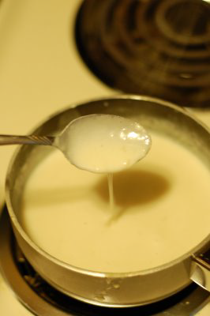

# Mornay sauce

*You can coat poached eggs, fish, vegetables and white meats with this sauce, then brown under a hot grill. This sauce can also be mixed with macaroni cheese.*

**Serves:** 4

**Prep Time:** 5 minutes

**Cook Time:** 15 minutes

## Overview
A refined derivative of béchamel sauce enriched with egg yolks, cream, and sharp Gruyère cheese. The result is a luxuriously velvety sauce with subtle nutmeg warmth and umami richness, perfect for gratins, poached eggs, and delicate white fish preparations.

## Ingredients

### Base sauce
- 500 ml [Béchamel Sauce](./bechamel-sauce.md)

### Enrichment
- 3 egg yolks
- 50 ml double cream
- 100 grams Gruyere cheese (finely grated)

### Seasoning
- 1 pinch nutmeg
- salt and pepper

## Method

### Stage 1 – Prepare liaison
1. Mix the egg yolks and cream together in a bowl.

### Stage 2 – Temper egg yolks
1. Pour the egg and cream mixture into the warm béchamel, whisking constantly.
1. Let the sauce bubble for about 1 minute, whisking continuously, to ensure yolks are fully cooked.

### Stage 3 – Add cheese
1. Take the pan off the heat.
1. Shower in the grated cheese and stir until melted.
1. Add nutmeg and taste, adjusting seasoning with salt and pepper as necessary.

### Stage 4 – Serve
1. Use immediately for poached eggs, fish, or vegetables that will be gratined.

## Notes
- **Gruyère cheese:** Essential for authentic flavour; other cheeses lack the necessary depth and melting quality.
- **Egg yolks:** Must be tempered slowly to avoid scrambling; constant whisking is crucial.
- **Nutmeg:** Use sparingly, just a pinch; this sauce already has subtle spice from the béchamel.

## Serving
Serve with poached eggs (Eggs Mornay), poached fish fillets, blanched vegetables, or white meats. Brown under a hot grill to create a golden crust before serving.

## Storage
- Can be made ahead and refrigerated for 1 day in an airtight container.
- Reheat gently over low heat, stirring frequently, being careful not to scramble the eggs.
- Can be frozen for up to 1 month; thaw in refrigerator before reheating.