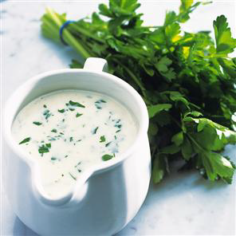

# Parsley sauce

*This sauce goes well with Brussels sprouts, carrots or potatoes. You can enrich the sauce with cream or butter, and serve with fish.*

**Serves:** 4

**Prep Time:** 5 minutes

**Cook Time:** 20 minutes

## Overview
A classic white roux-based sauce brightened with fresh parsley and fragrant nutmeg. Simple yet refined, this versatile accompaniment works equally well with vegetables or as an enriched accompaniment to delicate white fish preparations.

## Ingredients

### Roux base
- 20 grams butter
- 20 grams plain flour

### Liquid components
- 150 ml milk
- 350 ml ham or chicken stock

### Flavoring
- 2 tablespoons fresh parsley (chopped)
- 1 pinch nutmeg (freshly grated)
- 1 pinch salt and pepper

## Method

### Stage 1 – Make roux
1. Melt the butter in a small, heavy-based saucepan over a low heat.
1. Add the flour and stir with a whisk, cooking gently for 2-3 minutes to make a white roux.

### Stage 2 – Add liquids
1. Pour the cold milk onto the roux, mixing as you do so.
1. Whisk in the stock.

### Stage 3 – Cook & simmer
1. Bring to the boil over a medium heat, whisking continuously as the sauce begins to bubble.
1. Add the parsley and simmer the sauce for 15 minutes, skimming the surface with a spoon if necessary.

### Stage 4 – Season & serve
1. Season with nutmeg, salt and pepper then serve piping hot.

## Notes
- **White roux:** Cook for 2-3 minutes to eliminate flour taste without browning.
- **Fresh parsley:** Adds bright flavour; dried parsley will disappoint.
- **Skimming:** Removes impurities for cleaner, smoother sauce.

## Serving
Serve with Brussels sprouts, carrots, potatoes, cauliflower, or white fish. Can be enriched with cream or extra butter for richer preparations.

## Storage
- Keeps refrigerated for 2 days in an airtight container.
- Freezes well for up to 1 month.
- Reheat gently, stirring frequently, adding a splash of milk if thickened.