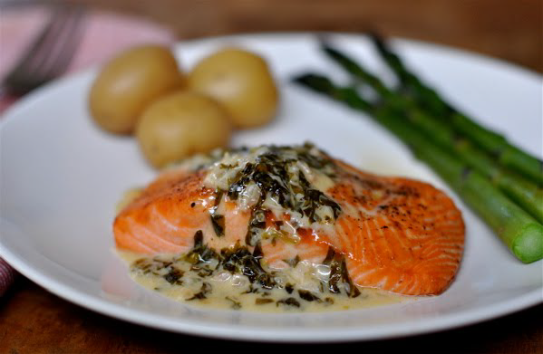

# Sorrel sauce

*With its hint of acidity, this sauce is ideal for serving with fish cakes or pan-fried lamb chops. A few shredded mint leaves added to the sauce just before serving intensifies the taste of the sorrel and gives the sauce a more rounded flavour.*

**Serves:** 6

**Prep Time:** 10 minutes

**Cook Time:** 20 minutes

## Overview
A refined, delicate sauce showcasing bright sorrel's natural acidity balanced with rich cream. The subtle herbal notes and tender green color make this an elegant companion to fish cakes and lamb, while optional mint intensifies complexity.

## Ingredients

### Aromatics
- 30 grams butter
- 40 grams shallots (finely chopped)

### Main ingredient
- 60 grams sorrel (fresh)

### Liquid components
- 100 ml white wine
- 200 ml vegetable stock
- 200 ml double cream

### Seasoning & finishing
- 1 pinch salt and pepper
- mint leaves (optional, for serving) 

## Method

### Stage 1 – Prepare sorrel
1. Wash the sorrel and remove the stalks.
1. Pile up several leaves, roll them up like a cigar and shred them finely.
1. Repeat until you have shredded all the sorrel.

### Stage 2 – Sweat aromatics & sorrel
1. Melt the butter in a deep frying pan over a low heat.
1. Add the shallots and sweat for 30 seconds.
1. Tip in the sorrel and sweat gently for another minute.

### Stage 3 – Reduce & cream
1. Pour in the white wine and vegetable stock and reduce the liquid by two-thirds over medium heat.
1. Add the cream and bubble for 2 minutes.

### Stage 4 – Season & finish
1. The sauce should be thick enough to coat the back of the spoon lightly.
1. Season with salt and pepper to taste.
1. Add shredded mint leaves if desired for intensified flavour.
1. Serve at once (or transfer to blender for 30 seconds to make a foam).

## Notes
- **Sorrel selection:** Choose young, tender leaves for milder acidity; mature sorrel is very tart.
- **Shredding:** Rolling sorrel like a cigar prevents browning and oxidation.
- **Foam variation:** Brief blending creates elegant foam for modern presentations.

## Serving
Serve with fish cakes, pan-fried lamb chops, grilled fish, or roasted poultry. The acidity brightens rich meats beautifully.

## Storage
- Keeps refrigerated for 1 day in an airtight container.
- Freezes for up to 2 weeks; slightly loses vibrant colour upon thawing.
- Reheat gently, stirring frequently; do not boil.