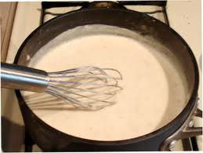

# Soubise sauce

*A variant of béchamel sauce that has a slightly sweet taste from sweated onions, and goes well with white meat or veal.*

**Serves:** 4

**Prep Time:** 10 minutes

**Cook Time:** 25 minutes

## Overview
An elegant onion-infused derivative of béchamel, where sweetly caramelized onions are pureed into the sauce for silky texture and subtle sweetness. Perfect accompaniment to white meats and veal, this refined sauce showcases the balance between cream, spice, and vegetable.

## Ingredients

### Base
- 300 ml [Béchamel Sauce](./bechamel-sauce.md)
- 40 grams butter
- 200 grams onion (thinly sliced)

### Finishing
- 150 ml double cream
- half a teaspoon nutmeg (freshly ground)
- 1 pinch salt and pepper

## Method

### Stage 1 – Sweat onions
1. Melt the butter in a saucepan over a low heat.
1. Add the onions and sweat for 5 minutes without colouring.

### Stage 2 – Combine with béchamel
1. Add the béchamel sauce and bring to the boil over a low heat.
1. Allow to bubble for 10 minutes, stirring frequently.

### Stage 3 – Pass & strain
1. Pass through a fine-meshed sieve into a clean saucepan.
1. Press the onions with the back of a ladle to extract as much flavour as possible.

### Stage 4 – Finish & season
1. Add the cream and cook gently for 6-8 minutes, stirring continuously, until the sauce has reduced and thickened.
1. Season to taste with salt, pepper and the nutmeg.

## Notes
- **Straining:** Essential to remove onion skins and achieve silky texture; do not skip.
- **Sweating without colour:** Keeps sauce pale and delicate; browning onions darkens the sauce.
- **Reduction:** The cream stage concentrates flavours and creates silky body.

## Serving
Serve with braised or roasted white meats (veal, chicken breast), blanched vegetables, or egg dishes.

## Storage
- Keeps refrigerated for 2 days in an airtight container.
- Freezes well for up to 1 month.
- Reheat gently over low heat, stirring frequently; add splash of milk if thickened.