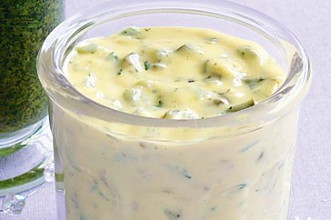

# Tartare Sauce

*Tartare sauce is a classic accompaniment to fried and grilled fish; it is also served with cold fish and shellfish.*

**Serves:** 6

**Prep Time:** 10 minutes

**Cook Time:** 0 minutes

## Overview
A vibrant, sophisticated cold sauce combining hard-boiled egg yolks with fragrant oil, tangy vinegar, and a combination of capers, onion, and fresh chives. This classic French accompaniment to fried fish showcases elegant simplicity with layered, briny flavors.

## Ingredients

### Base
- 3 egg yolks (hard boiled)
- 200 ml groundnut oil
- 1 tablespoon lemon juice

### Flavorings
- salt and pepper
- 20 grams onion (finely chopped, blanched, refreshed and drained)
- 3 tablespoons Mayonnaise
- 1 tablespoon chives (snipped)

## Method

### Stage 1 – Create egg base
1. Put the hard-boiled egg yolks into a mortar and pound with the pestle to make a smooth paste.
1. Season with salt and pepper.

### Stage 2 – Incorporate oil
1. Incorporate the groundnut oil in a thin stream, stirring continuously with the pestle.

### Stage 3 – Add finishing ingredients
1. When the oil is all incorporated, add the lemon juice.
1. Fold in the onion and mayonnaise.

### Stage 4 – Season & serve
1. Stir to combine, then add the chives.
1. Season with salt and pepper to taste.

## Notes
- **Egg yolk paste:** Pound thoroughly for smooth base; incomplete pounding results in gritty sauce.
- **Oil incorporation:** Slow, steady addition creates proper emulsion; rushing breaks sauce.
- **Blanched onion:** Softens harsh raw allium flavour; essential for refined taste.

## Serving
Serve chilled with fried fish (sole, plaice, cod), grilled fish, or cold fish and shellfish preparations. Classic with fish and chips.

## Storage
- Keeps refrigerated for 2 days in an airtight container.
- Does not freeze well; emulsion breaks upon thawing.
- Best eaten fresh for maximum flavour and emulsion stability.