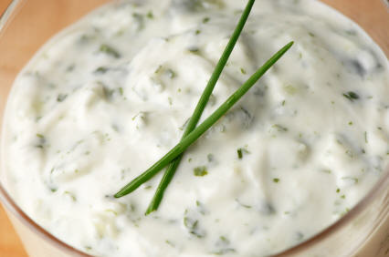

# Tzatziki sauce

*A Greek dip made from yogurt, chopped cucumber, and mint.*

**Serves:** 8

**Prep Time:** 10 minutes

**Cook Time:** 0 minutes

## Overview
A bright, refreshing dip from Greek cuisine pairing cool yogurt with crisp cucumber, aromatic garlic, and delicate chives. Simple and pure, yet sophisticated and elegant, this cooling sauce is perfect for warm weather gatherings and Mediterranean preparations.

## Ingredients

### Base
- 100 ml Greek yoghurt
- 1 clove garlic (crushed)

### Vegetables & herbs
- 8 cm cucumber (finely grated)
- 2 stalks chives

### Finishing
- 1 tablespoon lemon juice

## Method

### Stage 1 – Combine base
1. Mix together the yoghurt, lemon juice and garlic in a bowl.

### Stage 2 – Add cucumber
1. Fold in the grated cucumber gently, ensuring even distribution.

### Stage 3 – Chill
1. Refrigerate for at least 30 minutes before serving to allow flavours to meld.

### Stage 4 – Serve
1. Decorate with crossed stalks of the chives.
1. Serve chilled.

## Notes
- **Cucumber:** Grate and use immediately; excess moisture can dilute sauce.
- **Garlic:** Slightly overwhelming when raw; chilling mellows its intensity.
- **Chilling time:** Essential for flavour development; do not skip.

## Serving
Serve as dip with warm Turkish bread, crudités, grilled vegetables, or lamb dishes. Perfect accompaniment for Greek and Mediterranean meals.

## Storage
- Keeps refrigerated for 3 days in an airtight container.
- Does not freeze well; yogurt texture deteriorates upon thawing.
- Flavour improves slightly in first 24 hours as garlic mellows.