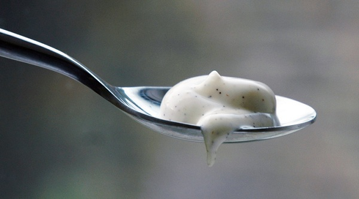

# Vanilla mayonnaise

*This is a light mayonnaise, due to the fact that it uses the egg whites as well as the yolk. It works especially well with liquorice poached salmon.*

**Serves:** Makes 400ml

**Prep Time:** 10 minutes

**Cook Time:** 0 minutes

## Overview
An elegant refinement of classic mayonnaise where fragrant vanilla seeds infuse the emulsion, while egg white adds unprecedented lightness. The subtle vanilla warmth and delicate texture make this sophisticated accompaniment to delicate fish preparations, particularly liquorice-poached salmon.

## Ingredients

### Base & emulsifier
- 1 large egg yolk
- 1 whole large egg
- 15 grams Dijon mustard
- seeds from 2 vanilla pods

### Oil & acid
- 350 grams groundnut oil
- 20 grams white wine vinegar

### Seasoning
- 5 grams salt

## Method

### Stage 1 – Combine base ingredients
1. Combine the egg yolk, whole egg, mustard, salt and vanilla seeds in a bowl.
1. Using a hand whisk, mix the ingredients together thoroughly.

### Stage 2 – Initial emulsification
1. Slowly add in the oil, a little at a time, whisking constantly.

### Stage 3 – Steady incorporation
1. When the mayonnaise begins to emulsify, pour in the oil in a steady stream, making sure you keep whisking.

### Stage 4 – Finish with acid
1. When the mayonnaise has emulsified, stir in the vinegar.
1. Check seasoning and adjust if necessary.

## Notes
- **Whole egg advantage:** The egg white provides body and reduces richness compared to yolk-only mayonnaise.
- **Vanilla seeds:** Essential for subtle flavour; vanilla extract is too strong and leaves bitter aftertaste.
- **Oil temperature:** Cold oil emulsifies best; room temperature oil creates separated, greasy result.

## Serving
Serve with poached salmon (especially liquorice-poached), other delicate white fish, or cold chicken. The vanilla adds sophistication without overwhelming delicate flavours.

## Storage
- Keeps refrigerated for 2 days in an airtight container.
- Does not freeze; emulsion breaks upon thawing.
- Best when made fresh; flavour and texture degrade with time.