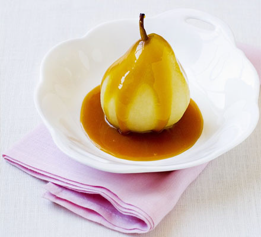

# Butterscotch sauce

*Serve this rich sauce with vanilla ice cream or an apple dessert such as apple Charlotte.*

**Serves:** 8

**Prep Time:** 5 minutes

**Cook Time:** 10 minutes

## Overview
A luxuriously rich, creamy sauce showcasing butter, vanilla, and deep caramel color. The syrup base and sugar create a complex sweetness balanced with vanilla's subtle warmth, while butter creates silky mouthfeel. This elegant sauce elevates simple vanilla ice cream into a sophisticated dessert.

## Ingredients

### Base
- 400 ml single cream
- 120 ml Sirop a sorbet (heavy)
- 75 grams caster sugar

### Flavoring & enrichment
- 1 vanilla pod
- 60 grams unsalted butter (diced)

## Method

### Stage 1 – Prepare vanilla
1. Split the vanilla pod length-ways and scrape out the seeds with the tip of a knife.

### Stage 2 – Combine base
1. Pour the cream into a heavy-based saucepan and add the sugar syrup and sugar.
1. Add the vanilla seeds to the pan.

### Stage 3 – Cook to proper color
1. Slowly bring to the boil, stirring continuously.
1. Let the mixture bubble gently, stirring continuously with a small whisk, until it is the colour of pale hazelnuts.

### Stage 4 – Finish with butter
1. Stir in the butter, a little at a time, until completely amalgamated.
1. Serve piping hot.

## Notes
- **Sirop a sorbet:** Heavy glucose syrup prevents sugar crystallization; essential for smooth sauce.
- **Color stage:** Pale hazelnut color indicates proper caramelization; monitor carefully as it darkens quickly.
- **Butter incorporation:** Whisk thoroughly to ensure smooth, glossy final sauce.

## Serving
Serve hot with vanilla ice cream, apple Charlotte, or other warm desserts. Can be poured over warm soufflés or puddings.

## Storage
- Keeps refrigerated for 5 days in an airtight container.
- Reheat gently over low heat, stirring frequently; do not boil.
- Can be frozen for up to 1 month; thaw slowly at room temperature.