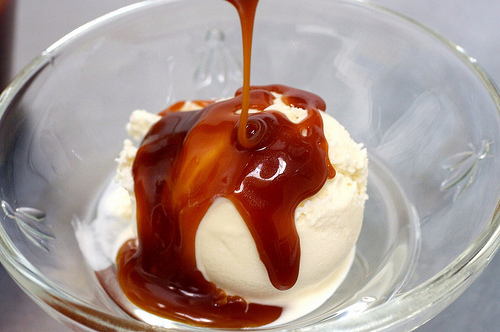

# Caramel with vanilla sauce

*This sauce is delectable drizzled over poached pears or pancakes, or even stirred into natural yoghurt.*

**Serves:** 6

**Prep Time:** 5 minutes

**Cook Time:** 15 minutes

## Overview
A luxuriously smooth sauce showcasing butter's richness combined with caramel's complex sweetness and vanilla's subtle warmth. Cream stirred into hot caramel creates a silky, refined sauce that elevates simple desserts to elegant presentations.

## Ingredients

### Caramel base
- 100 grams caster sugar
- 75 grams butter (softened)

### Flavoring
- 1 vanilla pod

### Enrichment
- 400 ml double cream

## Method

### Stage 1 – Prepare vanilla
1. Split the vanilla pod length-ways and scrape out the seeds with the tip of a knife.

### Stage 2 – Create caramel-butter base
1. Combine the sugar and butter in a heavy-based saucepan.
1. Add the vanilla seeds to the pan.
1. Set over a very low heat and stir continuously with a wooden spoon until the sugar has dissolved completely.

### Stage 3 – Cook to caramel color
1. Continue to cook until the mixture turns an attractive caramel colour.
1. Immediately take the pan off the heat and stir in the cream, protecting your hand with a cloth as the mixture may splutter.
1. Mix well to combine.

### Stage 4 – Finish cooking
1. Return to a medium heat and cook the sauce for 5 minutes, stirring continuously with a wooden spoon.
1. The sauce should be perfectly blended, smooth and shiny.
1. Pass it through a fine-meshed conical sieve and leave to cool.
1. Serve the sauce once it has cooled, or store in a sealed container in the fridge for up to 3 days.

## Notes
- **Low heat:** Essential for dissolving sugar without burning; fast heat creates grainy texture.
- **Cloth protection:** Hot caramel and cream react violently; cloth prevents burns.
- **Sieving:** Removes any sugar crystals that may have formed.

## Serving
Drizzle over poached pears, fresh pancakes, crêpes, or stir into natural yoghurt for simple elegance. Also excellent with vanilla ice cream or as topping for warm soufflés.

## Storage
- Keeps refrigerated for 3 days in an airtight container.
- Reheat gently over low heat, stirring frequently.
- Can be frozen for up to 1 month; thaw slowly at room temperature.