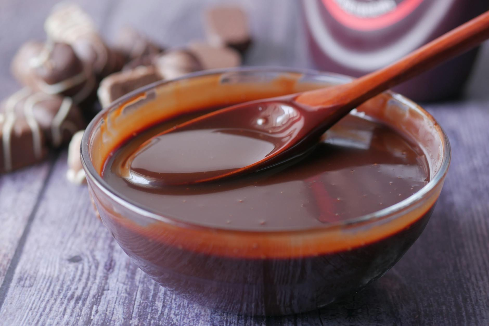

# Chocolate sauce

*Often used as a topping for various desserts, this sauce can also be used as a base for rich desserts to sit on. Sometimes a pinch of salt, when added to the chocolate can enrich its flavour and enhance the senses.*

**Serves:** 6

**Prep Time:** 5 minutes

**Cook Time:** 10 minutes

## Overview
A rich, silky chocolate sauce balancing 70% dark chocolate's subtle bitterness with sugar and cream's sweetness. Butter mounting at the end creates luxurious glossy finish. This fundamental dessert sauce adapts to various preparations with elegant sophistication.

## Ingredients

### Chocolate base
- 200 grams dark chocolate (70% cocoa)

### Liquid components
- 175 ml milk
- 2 tablespoons double cream
- 30 grams sugar

### Enrichment
- 30 grams butter

## Method

### Stage 1 – Melt chocolate
1. Melt the chocolate in a bain-marie over gentle heat.

### Stage 2 – Heat liquid components
1. Put the milk, cream and sugar in a saucepan and set over a high heat.
1. Stir gently with a whisk until the mixture boils.

### Stage 3 – Combine
1. Pour the hot milk mixture onto the melted chocolate, stirring constantly.
1. Tip the whole mixture into the saucepan and let it bubble for 15 seconds.

### Stage 4 – Finish
1. Take the pan off the heat and beat in the butter, a little at a time, until the sauce is completely homogeneous and glossy.
1. Pass through a conical strainer.
1. Serve immediately.

## Notes
- **Bain-marie:** Ensures gentle, even heating without scorching chocolate.
- **70% chocolate:** Essential for proper balance of bitterness and sweetness; milk chocolate creates cloying sauce.
- **Butter mounting:** Creates gloss and silky mouthfeel; do not omit.

## Serving
Serve warm over vanilla ice cream, profiteroles, pears, or other desserts. Can also be used as base for rich desserts to sit on.

## Storage
- Keeps refrigerated for 5 days in an airtight container.
- Reheat gently over low heat, stirring frequently.
- Can be frozen for up to 1 month; reheat gently to avoid breaking.