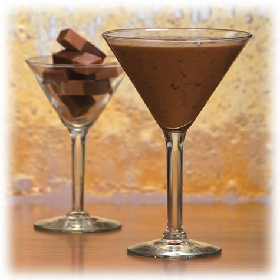

# Coffee sabayon with cinnamon

*This sabayon is delicious as a dessert in itself, served with lacy orange tuiles for contrast, but it also makes a tempting sauce to serve with fresh orange segments or poached pears.*

**Serves:** 4

**Prep Time:** 5 minutes

**Cook Time:** 15 minutes

## Overview
An ethereal, fluffy sauce showcasing aromatic coffee suspended in silky sabayon base. The whisked egg yolks and sugar create airy foam while cinnamon adds warmth and complexity. This refined sauce elevates simple fruit presentations to elegant desserts.

## Ingredients

### Base
- 1 tablespoon instant coffee
- 4 tablespoons cold water
- 4 egg yolks
- 50 grams caster sugar

### Flavoring
- 1/2 teaspoon ground cinnamon

## Method

### Stage 1 – Prepare bain-marie
1. Half fill a saucepan large enough to hold a round-bottomed copper bowl or heatproof glass bowl with warm water.
1. Place the pan over a low heat.

### Stage 2 – Prepare coffee base
1. Put the coffee and 4 tablespoons of cold water into the bowl and whisk with a balloon whisk to dissolve.
1. Lightly whisk in the egg yolks, sugar and cinnamon.

### Stage 3 – Whisk over bain-marie
1. Set the bowl in the bain-marie and whisk continuously for 10–12 minutes.
1. The mixture will thicken and increase dramatically in volume as air is incorporated.
1. The water in the bain-marie must not exceed 90°C and the temperature of the sabayon must not go above 65°C.
1. If necessary, turn off or lower the heat as you whisk.

### Stage 4 – Finish & serve
1. The sabayon is ready when it is light, fluffy and shiny, and thick enough to leave a dense ribbon when the whisk is lifted.
1. As soon as the sabayon is ready, stop whisking, spoon into glasses or a sauce-boat and serve immediately.

## Variations

**Coffee sabayon with Tia Maria**
- Dissolve the coffee in 3 tablespoons of water only.
- In place of the cinnamon, add 50 ml Tia Maria or Kahlua along with the sugar and egg yolks.

## Notes
- **Temperature control:** Essential for food safety and proper texture; watch carefully.
- **Whisking:** Constant whisking incorporates air; do not stop or mixture deflates.
- **Immediate service:** This sauce must be served immediately after whisking or it collapses.

## Serving
Serve immediately as dessert in itself with orange tuiles, or spoon over fresh orange segments, poached pears, or berries. For gratin presentation, spoon over fruit and place under hot grill until lightly grilled.

## Storage
- Does not store due to need for immediate service; make fresh for each service.
- Sabayon can be kept at room temperature for up to 30 minutes before deflating significantly.