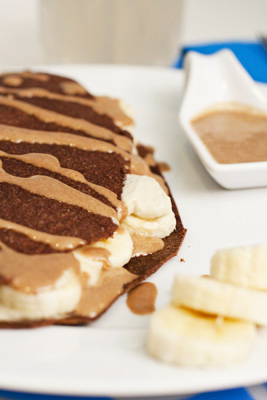

# Jasmine tea custard

*This delectable sauce is based on a recipe of the late, great chef Alain Chapel. It is especially delicious served with a slice of freshly grilled brioche, sprinkled with a veil of icing sugar.*

**Serves:** 4

**Prep Time:** 10 minutes

**Cook Time:** 40 minutes

## Overview
An elegant, delicate custard infused with aromatic jasmine tea, showcasing the balance between cream's richness and tea's subtle floral notes. Complex and refined, this sophisticated sauce elevates simple brioche or fresh fruit into restaurant-quality presentations.

## Ingredients

### Infusion
- 120 ml milk
- 250 ml whipping cream
- 3 tablespoons jasmine tea leaves

### Custard base
- 8 egg yolks
- 150 grams soft brown sugar

## Method

### Stage 1 – Infuse tea
1. Pour 100 ml milk and 250 ml cream into a small saucepan and slowly bring to the boil.
1. Immediately take the pan off the heat and stir in the tea leaves.
1. Cover the pan and leave to infuse for 2 minutes.

### Stage 2 – Temper egg yolks
1. Meanwhile, put the egg yolks and brown sugar into a bowl and work together lightly with a wooden spoon for about 1 minute.
1. Pour the hot infusion on to the egg mixture and mix thoroughly.
1. Stir in the remaining 500 ml cream and set aside to infuse for 30 minutes.

### Stage 3 – Strain & cook
1. Pass the mixture through a fine-meshed conical sieve into a clean saucepan.
1. Cook very gently for about 5 minutes, stirring continuously with a wooden spoon.

### Stage 4 – Cool & finish
1. Pour into a bowl and stir in the remaining 20 ml milk.
1. Leave to cool, stirring occasionally to prevent a skin from forming.
1. Cover and chill until ready to serve.

## Notes
- **Jasmine tea quality:** Use fresh, premium loose-leaf jasmine tea; bagged tea creates inferior flavour.
- **Two-minute infusion:** Longer steeping makes tea bitter; timing is critical.
- **Long cool infusion period:** Allows jasmine flavour to fully develop throughout custard.

## Serving
Serve chilled with grilled brioche sprinkled with icing sugar, or alongside fresh berries and meringues.

## Storage
- Keeps refrigerated for 3 days in an airtight container.
- Do not freeze; custard texture becomes granular upon thawing.
- Best made fresh; jasmine flavour fades with time.