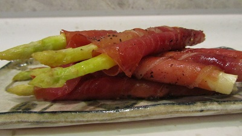

# Asparagus and prosciutto bundles

**Serves:** 4 - 6

## Overview
Asparagus and prosciutto bundles are an elegant starter or side dish where roasted asparagus spears are wrapped in delicate cured ham. The balsamic and olive oil dressing adds depth and a slight sweetness that pairs beautifully with the salty prosciutto.

## Ingredients
- 24 spears fresh asparagus (trimmed)
- 8 slices prosciutto (cut into thirds length-ways)
- 2 tablespoons olive oil
- 1 tablespoon balsamic vinegar
- 175 grams [hollandaise sauce](../sauces/sauce-savory/hollandaise-sauce.md) (optional)
- salt and freshly ground black pepper

## Method
1. Preheat the oven to 200°C.
1. Mix the olive oil and the balsamic vinegar together in a bowl, and season with salt and freshly ground black pepper.
1. Tip the asparagus into the bowl, and coat generously.
1. Place the asparagus on a baking tray, and pour the oil and vinegar mixture over the asparagus.
1. Place the tray in the oven, and cook for 5 minutes.
1. Once cooked, cut the spears in half and lay the bottom half of each spear next to its tip and secure together with a piece of prosciutto .
1. Serve warm with an optional hollandaise sauce dip.

## Notes
- Trim the woody ends of the asparagus before coating, snap each spear at its natural breaking point for best results.
- Do not overcook; 5 minutes at 200°C keeps the asparagus tender-crisp. Thicker spears may need an extra minute or two.
- Cutting the spears in half and pairing the tip with the base before wrapping gives each bundle a more uniform, presentable shape.
- The hollandaise sauce is optional but highly recommended, prepare it while the asparagus is in the oven so it is ready to serve immediately.

## Serving
Serve with: hollandaise sauce for dipping, or alongside grilled fish or roasted chicken as a starter or side
Temperature: warm, straight from the oven
Amount: 4 bundles per person as a side, 6 as a starter

## Storage
- Best eaten immediately; the prosciutto softens and the asparagus loses its texture if left to sit.
- Leftovers can be refrigerated in an airtight container for up to 1 day and eaten cold or gently reheated in the oven.