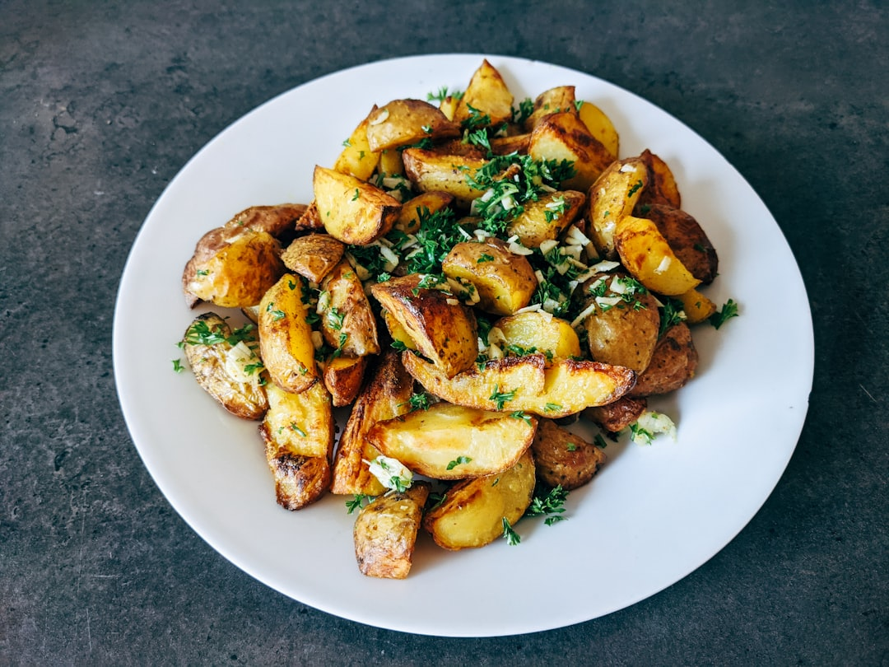

# Bombay Potatoes

**Serves:** 4-6

**Prep Time:** 10 minutes

**Cook Time:** 30 minutes

## Overview
This classic Indian vegetarian dish of potatoes is slow cooked in a richly flavoured curry sauce with fresh chillies for an added kick.

## Ingredients
### Vegetables
- 450 grams new potatoes
- 2 onions (finely chopped)
- 2 fresh green chillies (finely chopped)
- 50 grams coriander leaves (chopped)

### Spices
- 1 teaspoon ground turmeric
- 2 dried red chillies
- 6 curry leaves
- ¼ teaspoon asafoetida
- ½ teaspoon cumin seeds
- ½ teaspoon mustard seeds
- ½ teaspoon onion seeds
- ½ teaspoon fennel seeds
- ½ teaspoon kalonji seeds

### Fat
- 4 tablespoons vegetable oil

### Seasonings
- lemon juice (to taste)
- salt

### Garnish
- fried fresh curry leaves
- sesame seeds

## Method

### Stage 1 – Prepare potatoes
1. Chop the potatoes into small chunks.
1. Bring a pan of lightly salted water to the boil and add the potatoes with half the turmeric.
1. Cook for 15 - 20 minutes, or until tender.
1. Drain and set aside a few potatoes, and coarsely mash the rest. Set aside.

### Stage 2 – Make sauce
1. Heat the oil in a large heavy pan and fry the red chillies and curry leaves until the chillies begin to char, but before they burn.
1. Add the onions, fresh green chillies, coriander, remaining turmeric, asafoetida and spice seeds.
1. Cook the spices, stirring until the onions are tender.

### Stage 3 – Combine and cook
1. Fold in the potatoes and add a few drops of water.
1. Cook over a low heat for 10 minutes, stirring gently so that the potatoes absorb the spices without breaking up.
1. Remove the dried chillies and curry leaves.

### Stage 4 – Serve
1. Serve the potatoes hot, with lemon juice squeezed over and seasoned with salt.
1. Garnish with fried curry leaves, and a sprinkling of sesame seeds.

## Notes

## Serving
- Serve hot as a side dish.

## Storage
- Refrigerate leftovers for up to 3 days; reheat gently.