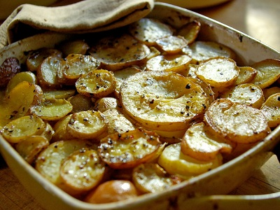

# Boulangère potatoes

*This classic French dish is simply potatoes with sliced onions and cooked in stock. It marries perfectly well with roast loin or leg of lamb.*

**Serves:** 4

## Overview
Boulangère potatoes are a classic French gratin of thinly sliced potatoes and softened onions baked slowly in stock until tender, with a golden, crispy top. Unlike dauphinoise, they use stock rather than cream, making them a lighter accompaniment that absorbs all the savoury cooking liquid beautifully.

## Ingredients
- 50 grams butter
- 2 onions (sliced)
- 675 grams potatoes (thinly sliced)
- salt and freshly ground white pepper
- 450 ml hot chicken stock (or vegetable stock)

## Method
1. Preheat the oven to 230°C.
1. Melt a little of the butter and fry the onions until softened.
1. Reserve some of the sliced potatoes to arrange on top of the dish, then mix the remaining potatoes with the cooked onions and season with salt and pepper.
1. Place the mixture in an oven-proof dish and cover with the reserved potato slices, overlapping them across the top.
1. Pour the hot stock over the potatoes and dot with the remaining butter.
1. Cook in the oven for 20 minutes, until the potatoes begin to colour.
1. Reduce the oven temperature to 200°C and cook for a further 40 - 45 minutes, pressing down on the potatoes with a wooden spatula occasionally.
1. By the end of the cooking, the potatoes will have absorbed the stock and should be golden and crispy on top.
1. To finish, sit the potatoes under a hot grill to achieve an extra rich golden colour.

## Notes
- Slice the potatoes as thinly and evenly as possible, a mandoline makes this much easier and ensures even cooking.
- Press down on the potatoes with a spatula during the longer cook to help them absorb the stock and compact into neat layers.
- Use hot stock rather than cold so the oven temperature is not reduced when it is poured over the potatoes.
- Keep a close eye under the grill at the end, the top can go from golden to burnt very quickly.

## Serving
Serve with: roast loin or leg of lamb, roast chicken, or any slow-roasted meat
Temperature: hot, straight from the oven or grill
Amount: one generous portion per person as a side dish

## Storage
- Leftovers keep well in the fridge for up to 3 days, covered with foil or in an airtight container.
- Reheat in the oven at 180°C for 15–20 minutes, or until piping hot throughout.
- The dish can be assembled a day ahead and refrigerated unbaked; add the stock just before cooking.