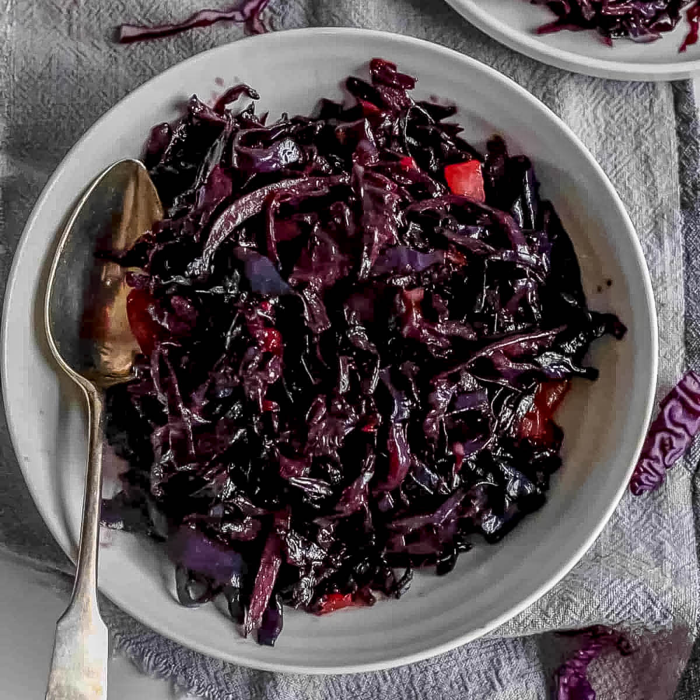

# Buttered Red Cabbage

*Sweet-and-sour braised red cabbage with apple, onion, vinegar and butter. The German / British / Eastern European Sunday-lunch staple; goes with goose, duck, pork, sausages, anything rich. Improves over a couple of days; make ahead.*

**Serves:** 6-8

**Prep Time:** 15 minutes

**Cook Time:** 1¼ hours

## Overview
Onion softens in butter; red cabbage joins along with sliced apple, brown sugar, red wine vinegar, a touch of red wine, cinnamon and cloves. Slow-cooks covered for an hour until the cabbage is silky and the liquid has reduced into a glossy glaze.

## Ingredients

- 1 medium red cabbage (about 1 kg, cored and finely shredded)
- 50 g unsalted butter
- 2 onions (sliced)
- 2 Bramley or other tart apples (peeled, cored, sliced)
- 4 tablespoons red wine vinegar
- 100 ml red wine (optional)
- 100 g brown sugar
- 1 cinnamon stick
- 4 cloves
- 1 bay leaf
- ½ teaspoon salt
- ¼ teaspoon black pepper

## Method

### Stage 1 – Soften the onion
1. Melt the butter in a large heavy pan over medium heat.
1. Cook the onions for 8-10 minutes until soft and sweet.

### Stage 2 – Build the cabbage
1. Add the shredded cabbage; stir to coat in butter.
1. Add the apples, vinegar, wine (if using), sugar, cinnamon, cloves, bay, salt and pepper.

### Stage 3 – Simmer
1. Bring to a gentle simmer; cover.
1. Cook on low heat for 1-1¼ hours, stirring occasionally, until the cabbage is silky-tender and the liquid has reduced.
1. If still wet at the end, uncover and reduce 5-10 minutes more.

### Stage 4 – Finish
1. Discard the cinnamon stick, cloves and bay leaf.
1. Taste; adjust with more vinegar (if too sweet) or sugar (if too sharp).

### Stage 5 – Serve
1. Pile into a warm bowl; serve alongside roast meats, sausages or game.

## Notes
- **Vinegar is structural:** It locks in the red colour and balances the sweetness. Without it, the cabbage turns blue-grey.
- **Bramley apples are best:** Tart and break down into the sauce. Cooking apples in general; eating apples stay too firm.
- **Make ahead:** Improves overnight. Genuinely better the next day.

## Storage
- Improves over 2-3 days. Keeps 5 days refrigerated.
- Freezes well for 3 months.
