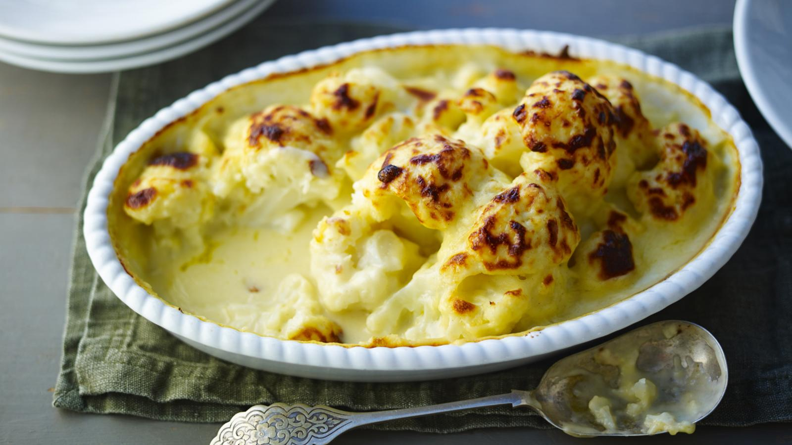

# Cauliflower Cheese

*British Sunday-lunch staple: blanched cauliflower in a sharp cheddar and mustard béchamel, topped with extra cheese and breadcrumbs, baked until bubbling and golden. The white sister to mac and cheese; pairs with roasts, particularly beef.*

**Serves:** 6

**Prep Time:** 15 minutes

**Cook Time:** 30 minutes

## Overview
Cauliflower florets blanch briefly so they're not raw but not cooked through. A béchamel takes mature cheddar, parmesan and mustard. The cauliflower nestles into the dish, the sauce drowns it, breadcrumbs and more cheese top, the oven does the rest.

## Ingredients

### Cauliflower
- 1 large cauliflower (broken into large florets)

### Sauce
- 50 g unsalted butter
- 50 g plain flour
- 700 ml whole milk (warm)
- 200 g mature cheddar (grated)
- 50 g parmesan (grated)
- 2 teaspoons English mustard (or Dijon)
- A grating of nutmeg
- Salt and freshly ground white pepper

### Topping
- 50 g panko or coarse breadcrumbs
- 50 g cheddar (grated)
- 30 g unsalted butter (melted)
- A few sprigs of fresh thyme

## Method

### Stage 1 – Blanch the cauliflower
1. Bring a large pan of well-salted water to the boil.
1. Add the cauliflower; cook 4-5 minutes until just-tender at the base (a knife enters with slight resistance).
1. Drain thoroughly; pat dry. Wet cauliflower waters down the sauce.

### Stage 2 – Béchamel
1. Heat the oven to 200°C (180°C fan).
1. Melt the butter in a heavy pan over medium heat.
1. Whisk in the flour; cook 1 minute.
1. Pour in the warm milk gradually, whisking until smooth and thickened.
1. Off the heat, stir in the cheddar, parmesan and mustard until melted.
1. Season with nutmeg, salt and pepper.

### Stage 3 – Assemble
1. Arrange the cauliflower florets in a baking dish, stem-side down.
1. Pour the cheese sauce over, making sure it covers all the florets.
1. Combine the breadcrumbs, extra cheddar, melted butter and thyme; scatter over the top.

### Stage 4 – Bake
1. Bake for 25-30 minutes until the top is deep golden and the sauce is bubbling at the edges.
1. Rest 5 minutes before serving (the sauce thickens as it sits).

## Notes
- **Don't overcook the cauliflower:** Blanched-tender, not soft. It cooks more in the oven; over-blanched gives mush.
- **Pat the cauliflower dry:** Wet cauliflower dilutes the sauce. Drain in a colander, let steam, dab with kitchen paper.
- **Mature cheddar minimum:** Mild cheddar gives bland cauliflower cheese. Mature, extra mature, or vintage are all good options.

## Storage
- Keeps 3 days refrigerated. Reheat at 180°C for 20 minutes covered with foil, then 5 uncovered to re-crisp the top.
- Freezes 2 months baked.
