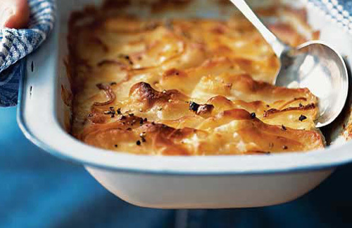

# Celeriac and potato dauphinoise

*This wonderful French potato dish includes the marriage of celeriac which balances out well, the warm flavours of this dish work well with steaks and beef dishes.*

**Serves:** 4

## Overview
Celeriac and potato dauphinoise is a rich, creamy French gratin that pairs the earthy nuttiness of celeriac with tender potato slices, all baked in a garlicky double cream. The addition of softened onions and a golden grilled top makes this an indulgent accompaniment to steaks and robust beef dishes.

## Ingredients
- 2 large onions (sliced)
- 50 grams butter
- 600 ml double cream
- 1 garlic clove (crushed)
- salt and freshly ground black pepper
- 450 grams potatoes (thinly sliced)
- 1 large celeriac (peeled and thinly sliced)

## Method
1. Preheat the oven to 180 - 190°C.
1. Cook the onions in half of the butter for 2 - 3 minutes, so they soften but do not colour, then set aside to cool.
1. Bring the cream to the boil in a pan, along with the crushed garlic and remaining butter. Season with salt and plenty of pepper.
1. Arrange the onions, potatoes and celeriac in a large oven-proof dish, making sure that the potatoes surround the celeriac .
1. Overlap the top layers of potatoes to give a neater finish.
1. Pour over the cream, making sure that the potatoes are completely covered.
1. Bake in the oven for 45 - 60 minutes until the vegetables are tender and have absorbed most of the cream.
1. Cover the potatoes with foil if they are browning too quickly.
1. Once cooked, if necessary, heat under a hot grill to give a golden colour.

## Notes
- Slice the potatoes and celeriac as thinly and evenly as possible, a mandoline ensures consistent thickness and even cooking.
- Soften the onions gently without colouring; browning them will alter the flavour of the finished dish.
- Ensure the cream fully covers the potato and celeriac layers before baking so the vegetables cook evenly and absorb the cream.
- Cover with foil partway through if the top is browning faster than the vegetables are softening inside.

## Serving
Serve with: steaks, roast beef, or other robust beef dishes
Temperature: hot, straight from the oven or grill
Amount: one generous portion per person as a side dish

## Storage
- Leftovers keep well in the fridge for up to 3 days, covered or in an airtight container.
- Reheat in the oven at 180°C for 15–20 minutes until piping hot throughout.
- The dish can be assembled and refrigerated a day ahead; bake from chilled, adding 10 minutes to the cooking time.