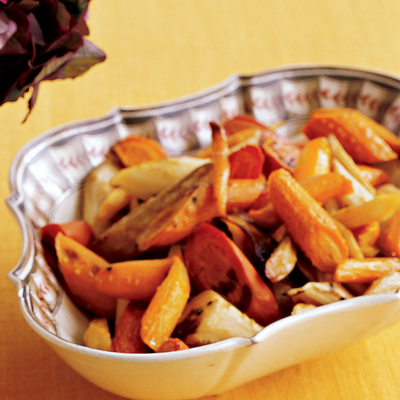

# Chanternay carrots and parsnips with maple syrup and a mustard glaze

*This wonderfully sweet glazed carrot and parsnip side dish compliments any hearty roast dinner with an air of elegance.*

**Serves:** 6

## Overview
Chanternay carrots and parsnips with maple syrup and mustard glaze is a sweet, sticky, and deeply flavoursome roasted vegetable side dish. The glaze of maple syrup, wholegrain mustard, and orange caramelises in the oven to coat the vegetables in a rich, glossy finish that elevates any roast dinner.

## Ingredients
- 300 grams Chanternay carrots (halved)
- 300 grams parsnips (peeled and cut into batons)
- 2 tablespoons olive oil
- 3 tablespoons maple syrup
- 1 tablespoon whole grain mustard
- zest and juice of half an orange

## Method
1. Preheat the oven to 200°c
1. Place the carrots and parsnips in a large roasting tin in a single layer. 
1. Drizzle with olive oil and season. 
1. Roast in the oven, turning occasionally for 30 minutes.
1. Mix the maple syrup, mustard and orange juice with zest in a jug and pour over the semi-roasted vegetables. 
1. Return to the oven and roast for a further 10-15 minutes until caramelised and sticky.

## Notes
- Spread the vegetables in a single layer in the roasting tin, overcrowding will cause them to steam rather than roast and caramelise.
- Turn the vegetables occasionally during the initial 30-minute roast to ensure even browning on all sides.
- Cut parsnip batons to a similar thickness as the halved carrots so everything cooks at the same rate.
- Watch closely during the final 10–15 minutes after adding the glaze, as the maple syrup can burn quickly at high heat.

## Serving
Serve with: roast beef, roast lamb, roast chicken, or any hearty roast dinner
Temperature: hot, straight from the oven
Amount: one portion per person as a side dish

## Storage
- Leftovers keep in the fridge in an airtight container for up to 3 days.
- Reheat in the oven at 180°C for 10 minutes, or in a frying pan over medium heat to restore some of the caramelised stickiness.