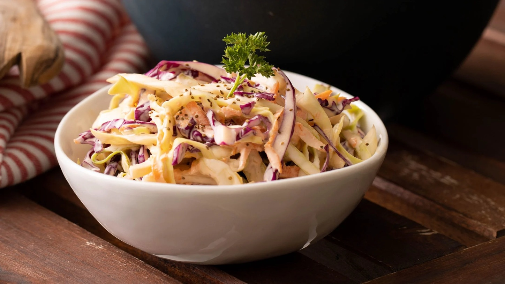

# Classic Coleslaw

*Cabbage, carrot, onion, and a tangy mayo dressing. The barbecue and burger sidekick; better made the day before so the cabbage softens slightly and the dressing soaks in. The shop-bought kind doesn't compare.*

**Serves:** 6-8

**Prep Time:** 15 minutes (plus 1 hour rest)

**Cook Time:** 0 minutes

## Overview
Cabbage shreds finely, carrots and onion shred or grate. Salt draws moisture out so the dressing isn't watered down later. Squeezed dry, tossed with a mayo-mustard-vinegar dressing, refrigerated to settle.

## Ingredients

### Salad
- ½ medium white cabbage (about 500 g; very finely shredded)
- 2 carrots (coarsely grated)
- 1 small red onion (very finely sliced)
- 1 teaspoon salt (to draw moisture)

### Dressing
- 6 tablespoons mayonnaise
- 2 tablespoons natural yogurt or soured cream
- 1 tablespoon Dijon mustard
- 1 tablespoon white wine vinegar (or cider vinegar)
- 1 teaspoon caster sugar
- ½ teaspoon celery salt or ¼ teaspoon ground celery seed
- Salt and freshly ground black pepper

### Optional
- 2 tablespoons chopped chives or parsley
- 1 apple (julienned or grated, for sweetness and crunch)

## Method

### Stage 1 – Salt the cabbage
1. Toss the shredded cabbage with the salt in a colander.
1. Let sit for 30 minutes; the salt draws out moisture (this is what stops the slaw being watery later).
1. Rinse briefly under cold water; squeeze hard in a clean cloth or your hands to expel as much liquid as possible.

### Stage 2 – Combine
1. Tip the squeezed cabbage into a bowl with the grated carrot and sliced onion.

### Stage 3 – Dressing
1. Whisk all the dressing ingredients in a small bowl.

### Stage 4 – Toss and rest
1. Pour the dressing over the vegetables; toss thoroughly.
1. Refrigerate at least 1 hour (or overnight); the slaw improves with time.

### Stage 5 – Serve
1. Stir before serving.
1. Stir in herbs or apple if using.

## Notes
- **Salt and squeeze:** The structural step that separates good coleslaw from a watery sad bowl. Don't skip.
- **Make ahead:** A day in the fridge is ideal; flavours marry, cabbage softens just enough.
- **Variations:** Sub mayo with all yogurt for lighter; add raisins or sultanas for a Waldorf lean; horseradish in the dressing is excellent with beef.

## Storage
- Keeps 3-4 days refrigerated; the cabbage softens day by day but flavour holds.
- Doesn't freeze.
