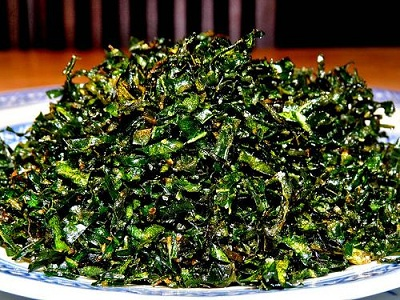

# Crispy cabbage

*This recipe dispels the myth that cabbage is tasteless and soggy, the crisp saltiness of the cabbage marries well with anything from a roast dinner to a Chinese dish.*

*It is important that when frying the cabbage to place a lid on the pan, as the high water content in the cabbage will cause the oil to spit.*

**Serves:** 4 - 6

## Overview
Crispy cabbage is a simple but satisfying deep-fried side dish that transforms savoy cabbage into light, golden, salted morsels with a satisfying crunch. Using a mix of outer and inner leaves creates a pleasing range of colour and texture, proving that cabbage can be far from tasteless or soggy.

## Ingredients
- half a savoy cabbage
- oil (for deep frying)
- salt

## Method
1. Cut the cabbage into three wedges, removing the core.
1. It is important to use the outside leaves, as well as the inner leaves for a good contrast in colours from light to deep green.
1. Heat the oil to 180°C.
1. Add the cabbage to the pan, and immediately place the lid on the pan to stop the oil from spitting.
1. Once the 'crackling' sound has stopped, the cabbage should be ready with just a little colouring around the edges.
1. Drain off all the excess fat on kitchen paper, and lightly salt.
1. Serve at once.

## Notes
- Always place the lid on the pan immediately after adding the cabbage, the high water content causes the oil to spit vigorously.
- Listen for the crackling sound to subside as the cue that the cabbage is ready; this indicates the surface moisture has cooked off.
- Use a mix of outer dark-green leaves and paler inner leaves for the best contrast of colour and texture.
- Salt lightly straight after draining while the cabbage is still hot so the seasoning adheres well.

## Serving
Serve with: roast dinners, Chinese-style dishes, grilled meats, or as a stand-alone crispy snack
Temperature: hot, served immediately after frying
Amount: a generous handful per person as a side

## Storage
- Best eaten immediately, the cabbage loses its crispiness quickly once cooked.
- Not suitable for refrigerating or reheating as the texture will become limp.