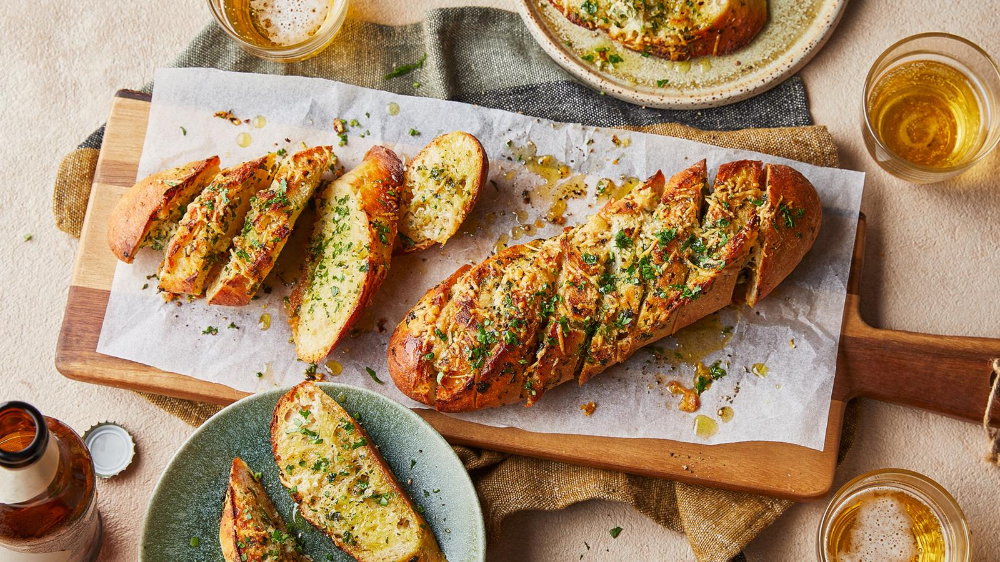

# Garlic Bread

*Crusty baguette split, slathered with garlic-parsley butter, wrapped in foil and baked until the butter has melted into every crumb. The pasta side that never disappoints; equally happy alongside a soup or grilled meats.*

**Serves:** 6-8

**Prep Time:** 10 minutes

**Cook Time:** 15 minutes

## Overview
Soft butter beats together with crushed garlic, parsley and a touch of salt. The butter spreads onto split baguette halves (or down the middle of a long loaf). Wrapped in foil, baked, then opened and grilled briefly to crisp the top.

## Ingredients

- 1 large baguette or 1 ciabatta loaf
- 150 g unsalted butter (very soft, at room temperature)
- 6 garlic cloves (crushed)
- 1 small bunch flat-leaf parsley (very finely chopped)
- 1 teaspoon flaky sea salt
- A grind of black pepper
- Optional: 50 g grated parmesan
- Optional: 1 teaspoon dried chilli flakes

## Method

### Stage 1 – Garlic butter
1. In a bowl, mash the soft butter with the garlic, parsley, salt, pepper and parmesan or chilli flakes (if using).
1. The butter should look uniformly green-flecked and well combined.

### Stage 2 – Prep the bread
1. Heat the oven to 200°C (180°C fan).
1. Cut the baguette in half horizontally (or make deep cuts every 3 cm without cutting through the bottom — this makes a tear-and-share loaf).

### Stage 3 – Spread
1. Slather the cut surfaces (or push butter into the cuts) generously with the garlic butter. All of it should be used.

### Stage 4 – Bake
1. Wrap the loaf loosely in foil.
1. Bake for 10 minutes (the foil keeps the crust from burning while the centre warms through).
1. Open the foil; bake another 3-5 minutes until the surface is golden and the butter has melted into the crumb.

### Stage 5 – Serve
1. Slice or pull apart at the table while the butter is still glistening.

## Notes
- **Soft butter is non-negotiable:** Cold butter doesn't spread and ends up clumped. Take it out of the fridge an hour before, or microwave 5 seconds at a time.
- **Foil first, then open:** The foil keeps the crust from going hard while the middle warms; opening at the end crisps it.
- **Crusty bread, not soft:** A baguette or ciabatta gives the contrast of crisp shell and soft soaked centre. Sliced sandwich bread doesn't work.

## Storage
- Best fresh. Keeps 1 day; reheat at 180°C wrapped in foil for 8 minutes.
- Garlic butter alone keeps 5 days refrigerated, freezes 2 months.
