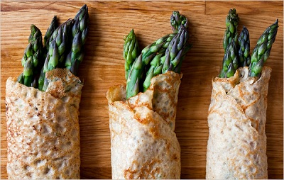

# Herb crêpes

*These crêpes work really well when sandwiched between meat and pastry, as it forms a protective layer beneath the pastry to help keep it dry and crisp.*

**Servings:** 6

## Overview
Herb crêpes are thin, delicate pancakes enriched with fresh herbs such as parsley, chervil, and chives. They are particularly useful in dishes like Beef Wellington, where they are layered between the meat and pastry to act as a moisture barrier and keep the pastry crisp. The rested batter ensures a smooth, even texture with a light, pliable result.

## Ingredients
- 60 grams plain flour
- 150 ml milk
- 2 eggs
- salt and fresh ground pepper
- 15 grams chopped herbs (parsley, chervil, chives)
- 30 grams clarified butter

## Method
## Making the batter
1. Put the flour into a bowl and make a well.
1. Add one-third of the milk, the eggs, a pinch of salt and a turn of the pepper mill.
1. Mix lightly with a whisk to make a smooth batter, then pour in the rest of the milk and mix thoroughly.
1. Pass the batter through a chinois or fine-meshed conical sieve.
1. Cover with cling film and leave to rest for at least 30 minutes.
1. Stir the herbs into the batter just before cooking the crêpes.

## Cooking the crêpes
1. Lightly grease a 26 - 30 cm frying pan with a touch of clarified butter.
1. Give the batter a stir, then ladle in just enough to cover the base of the pan.
1. Cook quickly for about 1 minute, then turn the crêpe over with a palette knife and cook for barely a minute.
1. Repeat until you have used all the batter
1. Stack the cooked crêpes on a plate, layering a piece of greaseproof paper between each one to prevent them from sticking together.

## Notes
- Resting the batter for at least 30 minutes allows the gluten to relax, resulting in more tender, even crêpes.
- Sieve the batter through a fine-meshed chinois to eliminate lumps before resting.
- Stir the herbs in just before cooking, adding them earlier can discolour the herbs and affect the batter consistency.
- Use only a touch of clarified butter per crêpe; too much fat will prevent the crêpe from spreading thinly across the pan.

## Serving
Serve with: used as a component in dishes such as Beef Wellington or other wrapped preparations; not typically served alone
Temperature: room temperature when used as a wrapping layer; warm if served as a standalone crêpe
Amount: 1–2 crêpes per person depending on use

## Storage
- Stack cooled crêpes with greaseproof paper between each one to prevent sticking.
- Store wrapped in cling film in the refrigerator for up to 2 days.
- Freeze interleaved with greaseproof paper for up to 1 month; defrost at room temperature before use.