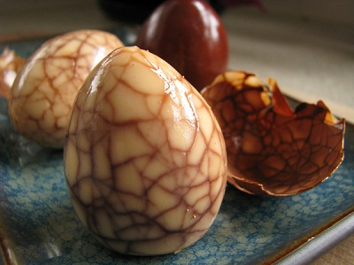

# Marbled tea eggs

*This unique method of cooking eggs in spiced tea derives its name from the marbled texture and web of cracks which appear on the surface of eggs when they are shelled.*

*Traditionally, tea eggs are served cold and make a wonderful and easy garnish for cold platters. Once the eggs have cooled, they can be kept in the tea liquid in the refrigerator for up to 2 days.*

**Servings:** 4 - 6

## Overview
Marbled tea eggs are a classic Chinese preparation in which hard-boiled eggs are cracked and simmered in a spiced black tea broth, creating a striking web-like pattern on the surface once peeled. The soy sauce, cinnamon, and star anise infuse the eggs with a deep, aromatic flavour that complements their visual appeal. They are traditionally served cold and make an elegant garnish or snack alongside other cold dishes.

## Ingredients
-  6 eggs (at room temperature)
- 1.7 litres water

### Tea mixture
- 3 tablespoons black Chinese tea
- 2 tablespoons dark soy sauce
- 1 teaspoon salt
- 1 cinnamon stick
- 1 star anise

## Method
1. Fill a large pot with the water and bring to the boil.
1. Using a large slotted spoon, lower the eggs into the pot and lower the water to a gentle simmer.
1. Cook the eggs for 10 minutes, then remove them and place in a bowl of cold water (Do not discard the cooking water).
1. After 10 minutes, when the eggs have cooled, gently crack each shell with the back of a spoon until the entire shell is a network of cracks.
1. Take the pot of water in which the eggs have been cooked and combine it with the tea mixture.
1. Bring the mixture to a boil and return the cracked eggs to the pot.
1. Reduce the heat to a simmer and cook the eggs for about 25 minutes.
1. Remove the pot from the heat and allow the eggs to cool in the liquid.
1. Remove the eggs from the cooled liquid and gently peel off the cracked shells.
1. You should have a beautiful marble-like web on each egg.
1. Serve them cut in half or quarters as a snack with other cold dishes or use them as a garnish.

## Notes
- Start the eggs at room temperature and lower them gently into simmering water to prevent cracking before the shells are deliberately broken.
- Do not discard the initial cooking water, it is used as the base for the tea mixture to concentrate flavour.
- Crack the shells evenly all over with the back of a spoon; a denser network of cracks produces a more pronounced marbled effect.
- Allow the eggs to cool fully in the liquid before peeling for the deepest colour and flavour penetration.

## Serving
Serve with: cold platters, other cold dishes, or as a garnish; can be accompanied by a light soy dipping sauce
Temperature: cold or at room temperature
Amount: 1–2 eggs per person as a snack or garnish

## Storage
- Store unpeeled eggs submerged in the tea liquid in the refrigerator for up to 2 days.
- Once peeled, consume within 24 hours and keep refrigerated.
- Do not freeze, as the texture of the egg white becomes rubbery upon thawing.