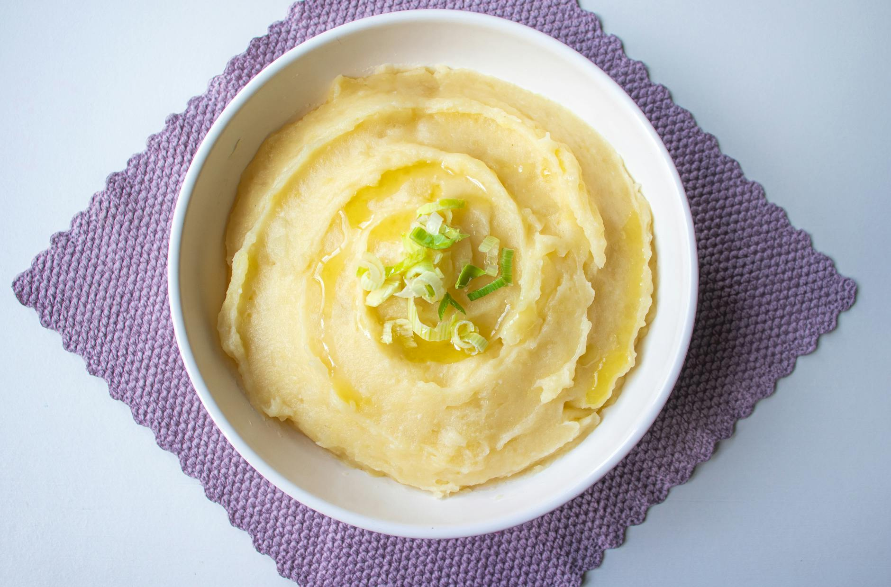

# Buttery Mashed Potatoes

*The silkiest mash: floury potatoes, plenty of butter, warm milk, salt. The technique is steaming-dry the boiled potatoes before mashing, riced not whisked, butter first, milk second. Avoid a food processor — it turns potatoes glue.*

**Serves:** 4-6

**Prep Time:** 5 minutes

**Cook Time:** 25 minutes

## Overview
Maris Piper potatoes peel and chunk, boil in well-salted water until very tender, drain, return to the hot pan to steam off any moisture. Pass through a ricer or food mill into a clean pan. Cold butter cubes whisk in first; warm milk loosens to the right consistency; salt to taste.

## Ingredients

- 1 kg Maris Piper or King Edward potatoes (peeled, cut into 4 cm chunks)
- 1 tablespoon salt (for the water)
- 100 g unsalted butter (cold, cubed)
- 150 ml whole milk (warm)
- Salt and freshly ground white pepper
- A grating of nutmeg (optional)

## Method

### Stage 1 – Boil
1. Place the potatoes in a large pan; cover with cold water; add the tablespoon of salt.
1. Bring to a simmer; cook 15-18 minutes until very tender (a knife slides through with no resistance).

### Stage 2 – Dry
1. Drain in a colander; return to the hot pan off the heat.
1. Cover loosely with a tea towel; let steam for 2-3 minutes (this dries the potatoes; wet potatoes give wet mash).

### Stage 3 – Rice
1. Pass the potatoes through a ricer or food mill into a clean pan or bowl.
1. (No ricer? Mash with a hand masher; never use a food processor — it activates starch and gives glue.)

### Stage 4 – Butter and milk
1. Add the cold butter cubes to the riced potato; whisk gently with a wooden spoon until incorporated.
1. Pour in the warm milk gradually, whisking, until the mash reaches the consistency you want.
1. Season with salt, white pepper and a grating of nutmeg if using.

### Stage 5 – Serve
1. Pile into a warmed bowl.
1. Top with an extra knob of butter melting on top.

## Notes
- **Floury potatoes only:** Maris Piper or King Edward. Waxy potatoes (Charlotte, new potatoes) mash gluey.
- **Steam dry before mashing:** Wet potatoes = wet mash. The 2-minute steam is structural.
- **Cold butter, warm milk:** Cold butter incorporates into the warm potato slowly, giving a glossier finish. Warm milk doesn't chill the mash on contact.

## Storage
- Best fresh. Keeps 2 days refrigerated; loosen with extra warm milk and butter when reheating gently.
