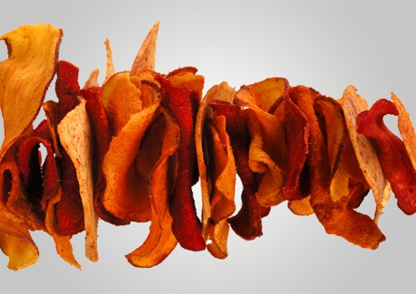

# Potato and parsnip crisps

*The potato and parsnips crisps are wonderful as pre-dinner snacks or as a garnish for a main meal. They are simple to make and taste amazing.*

**Serves:** 4

## Overview
Potato and parsnip crisps are paper-thin slices of potato and parsnip deep fried until golden and shatteringly crisp. The natural sweetness of the parsnip contrasts beautifully with the starchy potato, and together they make an elegant and addictive snack. They work equally well as a pre-dinner nibble or as a delicate garnish for a plated main course.

## Ingredients
- 2 large potatoes (peeled)
- 3 large parsnips (peeled)
- 1 litre oil (for frying)
- salt

## Method
1. Using a vegetable peeler or mandolin, slice the potatoes very, very thinly.
1. Using a vegetable peeler or mandolin, slice the parsnips length-ways very, very thinly.
1. Dry the slices on a piece of kitchen roll.
1. Pre-heat a deep fat frying pan to 180°C.
1. Fry the potato crisps and parsnips a handful at a time until crisp and golden all the way through.
1. Remove from the oil, and shake off any excess oil.
1. Sprinkle over salt, and serve.

## Notes
- Slice as thinly as possible, a mandolin gives the most consistent results and is worth using if available.
- Thoroughly drying the slices on kitchen paper before frying is essential; any surface moisture will cause the oil to spit and produce soggy crisps.
- Fry in small handfuls to avoid dropping the oil temperature, which results in greasy rather than crispy crisps.
- Season with salt immediately after removing from the oil so it adheres while the surface is still hot.

## Serving
Serve with: pre-dinner drinks as a snack, or as a garnish for soups, salads, or plated main courses
Temperature: warm or at room temperature, served immediately after frying
Amount: a generous handful per person as a snack; a small bundle as a garnish

## Storage
- Best eaten immediately after frying as they lose their crispness quickly.
- Store in an airtight container at room temperature for up to 1 day; avoid refrigerating as moisture will soften them.
- Re-crisp briefly in a hot oven at 200°C for 3–4 minutes if needed before serving.